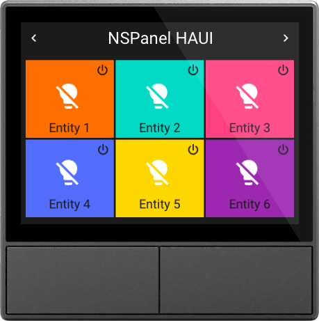
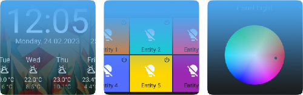
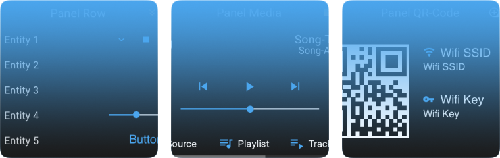

# NSPanel HAUI (HomeAssistant UI)

`nspanel_haui` is a versatile display system for HomeAssistant based smart homes.

- [NSPanel HAUI (HomeAssistant UI)](#nspanel-haui-homeassistant-ui)
  - [About](#about)
  - [Features](#features)
    - [Easy Installation](#easy-installation)
    - [Device display configuration in a single yaml file](#device-display-configuration-in-a-single-yaml-file)
    - [A variety of different panels](#a-variety-of-different-panels)
    - [Touch gestures and sequences](#touch-gestures-and-sequences)
    - [Live state updates](#live-state-updates)
    - [Button and relay states, coupled and uncoupled relays](#button-and-relay-states-coupled-and-uncoupled-relays)
    - [Dimming of the display after a timeout](#dimming-of-the-display-after-a-timeout)
    - [Sleep display change after a timeout](#sleep-display-change-after-a-timeout)
    - [Locking/Unlocking mechanism for panels](#lockingunlocking-mechanism-for-panels)
    - [Device settings in HomeAssistant](#device-settings-in-homeassistant)
  - [Installation](#installation)
  - [Next Steps](#next-steps)
  - [Development](#development)
  - [Roadmap](#roadmap)
  - [Resources](#resources)

## About

NSPanel HAUI was started as a replacement for the original Sonoff Firmware. It provides a flexible way to configure the display and to control devices connected to home assistant.

It focuses on HomeAssistant and ESPHome. It does not use any custom protocol to communicate with the nextion display. Instead the display is completely controlled through the AppDaemon app written in python.

For details about the configuration see [Configuration](docs/Config.md). Also take a look at [Panels](docs/panels/README.md) to get an overview of available panels.

## Features

### Easy Installation

The nspanel_haui will load most parts of the required files automatically. Only the initial ESPHome flashing process is needed. After this all parts will be updated by the AppDaemon app.

### Device display configuration in a single yaml file

The whole configuration is located in the `apps.yaml` file. The configuration is done per device.

### A variety of different panels

  

  

  Select from different [Panels](docs/panels/README.md) that can be displayed on the panel.

### Touch gestures and sequences

  

  Different touch gestures as swipe left or right are supported. There is also support for gesture sequences.

### Live state updates

  

  The display will update when a entity state changes. All entities being displayed will notify about changes and the display will update.

### Button and relay states, coupled and uncoupled relays

  

  The buttons can be used in a couped state, so that by button presses, the relay will get activated. It is also possible to disable the relay and use the physical buttons as software buttonms.

### Dimming of the display after a timeout

  

  The display will automatically dim its brightness after a timeout.

### Sleep display change after a timeout

  

  The display can switch to a page after a timeout. There are sleep and wakeup panels possible.

### Locking/Unlocking mechanism for panels

  

  All panels can be locked by a pin code. The panel can be accessed after entering the pin code.

### Device settings in HomeAssistant

  

  The whole device configuration can be done in HomeAssistant.

## Installation

In order to install NSPanel HAUI it is neccessary to flash the Panel with ESPHome.

The simplified process is as followed:

1. Flash Panel with [ESPHome](docs/ESPHome.md)
2. Update [Display TFT](docs/Nextion.md)
3. Install [AppDaemon App](docs/AppDaemon.md)
4. Add [Configuration](docs/Config.md)

Take a look at the more detailed [Installation Guide](docs/Install.md). Have also a look at the [FAQ](docs/FAQ.md).
For a more detailed overview of available functionality see the [Device Description](docs/Device.md).

## Next Steps

- [Documentation](docs/README.md)
- [Panels Overview](docs/panels/README.md)
- [Example Configurations](docs/Example_Config.md)
- [Icons Cheatsheet](https://htmlpreview.github.io/?https://raw.githubusercontent.com/happydasch/nspanel_haui/master/docs/cheatsheet.html)
- [Thread in HomeAssistant Community](https://community.home-assistant.io/t/sonoff-nspanel-haui-homeassistant-ui/578570)

## Development

For details about how the parts of the whole system communicate together see [NS
Panel HomeAssistant UI Docs](docs/README.md).

- [Design Guidelines](docs/Design.md)
- [Communication Description](docs/Communication.md)
- [ESPHome Component](docs/ESPHome.md)
- [AppDaemon Component](docs/AppDaemon.md)
- [Nextion Component](docs/Nextion.md)

## Roadmap

- **Versions 0.1.x**: Into the wild - basic functionality, auto updates, cleanups

  First versions, get basic functionality running

  - stable core, basic functionality and panels are available
  - available panels:
    - screensaver: weather, clock
    - overview: grid, row
    - panels: light, media, vacuum, qr code, cover, climate, timer
  - functionality:
    - locking panels
    - popups

- **Versions 0.2.x**: Sort it out - configuration and entity handling

  Configuration and entity handling, more definitions, better code, sort out issues

  Things done for this cycle:

  - clock: restyle clock, only 3 days forecast, show notifications icon.
  - weather: show notifications icon.
  - clocktwo: new sleep screen with time as written text.
  - light: various updates
  - music: fix media lists
  - wakeup: make the wakeup process more configureable. add default wakeup behaviour.
  - wakeup: open previous panel if display was not off, open home panel if display was off after wakeup.
  - eye-candy:
    - wider sliders in different screens
  - sounds: play sounds on startup and on notifications.

  Things for this cycle to finish:

  - notifications: receive notifications and show them on the display. Show an icon on the home panel and on sleep panels. Notifications are available and can be opened and closed until discarded.
  - new panels:
    - notification: show current notifications.
  - new functionality:
    - simplify config, internal handling
    - prepare for backend
  - panels eye-candy:
    - time in title?

- **Future**:

  - Replace AppDaemon with Home Assistant Integration

## Resources

The project is based on the ideas of [NSPanel Lovelace UI](https://github.com/joBr99/nspanel-lovelace-ui) and [NSPanel Custom with HA Blueprint](https://github.com/Blackymas/NSPanel_HA_Blueprint).

- https://esphome.io
- https://nextion.tech/instruction-set/
- https://docs.nspanel.pky.eu/
- https://github.com/joBr99/nspanel-lovelace-ui
- https://github.com/joBr99/Generate-HASP-Fonts
- https://github.com/Blackymas/NSPanel_HA_Blueprint
- https://github.com/masto/NSPanel-Demo-Files
- https://github.com/marcfager/nspanel-mf
- https://github.com/krizkontrolz/Home-Assistant-nextion_handler
