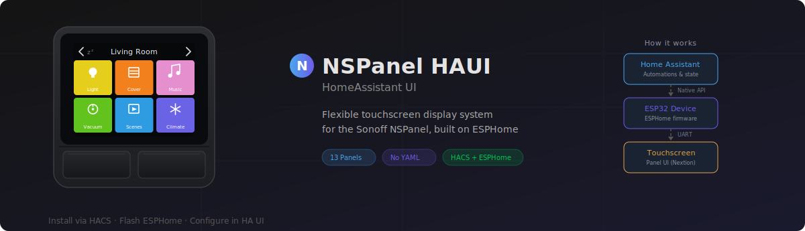
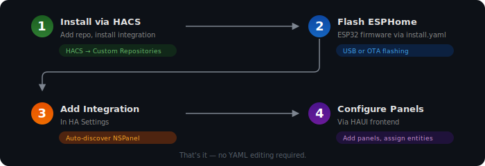
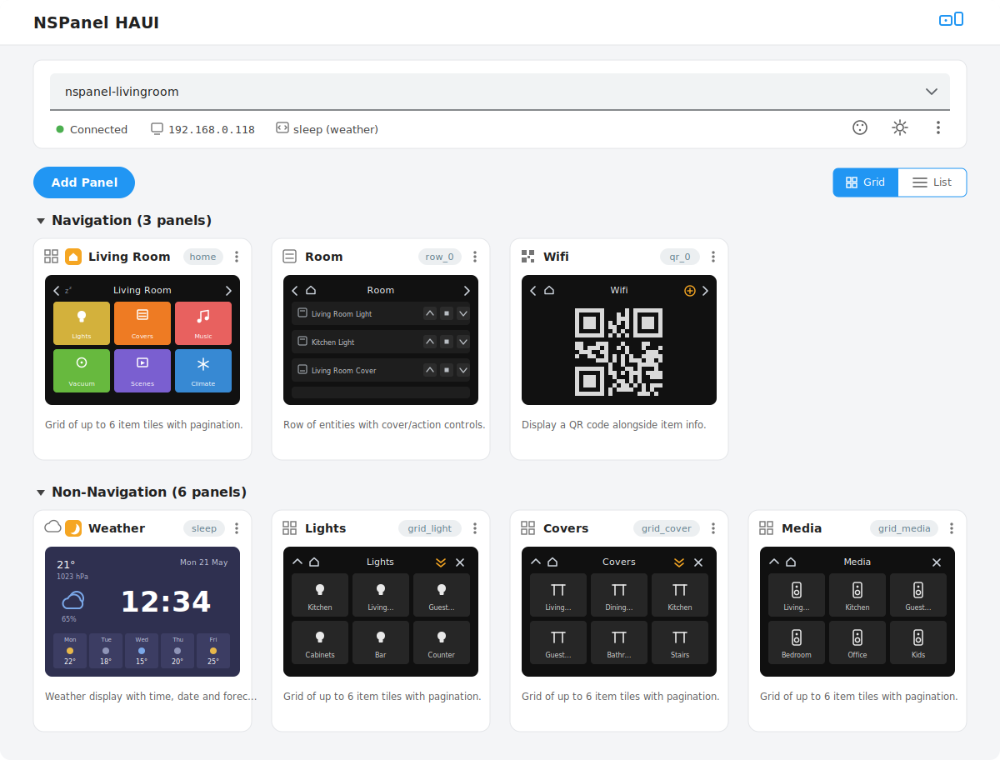
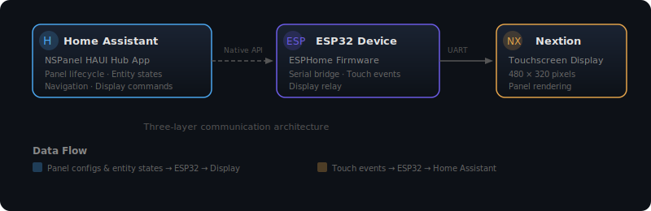

# NSPanel HAUI (HomeAssistant UI)

  

  <b>A flexible touchscreen display system for the Sonoff NSPanel, built on ESPHome.</b> 
  All configuration is done through a built-in web frontend — a Lovelace panel 
  inside Home Assistant that provides a visual editor for panels, entities, 
  gestures, colors, and more.

---

  <a href="docs/README.md"><b>Documentation</b></a> ·
  <a href="docs/panels/README.md"><b>Panels Overview</b></a> ·
  <a href="docs/install.md"><b>Installation Guide</b></a> ·
  <a href="docs/config.md"><b>Configuration</b></a> ·
  <a href="docs/faq.md"><b>FAQ</b></a> ·
  <a href="docs/example_config.md"><b>Example Configs</b></a>

---

## Quick Start

Get NSPanel HAUI up and running with a display dashboard in just 4 steps:

  

1. **Install via HACS** — Add the custom repository, install the integration, and restart Home Assistant.

   [Install guide →](docs/install.md)

2. **Flash ESPHome** — Use `esphome/install.yaml` as a starting point, configure your Wi-Fi, and flash via USB or OTA.

   [ESPHome guide →](docs/esphome.md)

3. **Add Integration** — Go to Settings → Devices & Services → Add NSPanel HAUI. It auto-discovers your device.

   [Config flow →](docs/custom_integration.md)

4. **Configure Panels** — Open the web frontend, add panels, assign entities, and set colors to your liking.

   [Configuration guide →](docs/config.md)

---

## Features

<table>
  <tr>
    <td align="center" valign="top" width="16%">
       
      <b>13 Panel Types</b> 
      <small>Grid, light, climate, cover, media, weather, and more</small>
    </td>
    <td align="center" valign="top" width="16%">
       
      <b>Touch + Gestures</b> 
      <small>Swipe navigation, gesture sequences, tap interactions</small>
    </td>
    <td align="center" valign="top" width="16%">
       
      <b>Full Customization</b> 
      <small>Per-entity colors, icons, backgrounds, themes</small>
    </td>
    <td align="center" valign="top" width="16%">
       
      <b>Auto-Dimming</b> 
      <small>Smart sleep/wake, ambient light sensor, screensaver</small>
    </td>
    <td align="center" valign="top" width="16%">
       
      <b>Visual Editor</b> 
      <small>Built-in Lovelace panel with live previews, drag reorder, color pickers</small>
    </td>
    <td align="center" valign="top" width="16%">
       
      <b>Multi-Language</b> 
      <small>English, German, Dutch, Polish, French</small>
    </td>
  </tr>
  <tr>
    <td align="center" valign="top" width="16%">
       
      <b>Notifications</b> 
      <small>Sound alerts, toasts, notification queue on display</small>
    </td>
    <td align="center" valign="top" width="16%">
       
      <b>Panel Locking</b> 
      <small>PIN-protected unlock for sensitive controls</small>
    </td>
    <td align="center" valign="top" width="16%">
       
      <b>ESPHome Native API</b> 
      <small>Fast, reliable communication with the display</small>
    </td>
    <td align="center" valign="top" width="16%">
       
      <b>Screensaver Modes</b> 
      <small>Clock, weather, clock-two (text) display modes</small>
    </td>
    <td align="center" valign="top" width="16%">
       
      <b>Hardware Buttons</b> 
      <small>Physical rocker switch support with custom actions</small>
    </td>
    <td align="center" valign="top" width="16%">
       
      <b>QR Code Display</b> 
      <small>Show Wi-Fi details, URLs, or text as QR codes</small>
    </td>
  </tr>
</table>

---

## Available Panels

See the <a href="docs/panels/README.md">Panels Overview</a> for details.

<table>
  <tr>
    <td width="33%" valign="top">
       
      <b><a href="docs/panels/panel_grid.md">Grid</a></b> <code>grid</code> 
      <small>Up to 6 entities in a scrollable grid layout. Color overrides, power buttons.</small>
    </td>
    <td width="33%" valign="top">
       
      <b><a href="docs/panels/panel_row.md">Row</a></b> <code>row</code> 
      <small>Up to 5 entities in a vertical scrollable rows. Compact, text-focused layout.</small>
    </td>
    <td width="33%" valign="top">
       
      <b><a href="docs/panels/panel_light.md">Light</a></b> <code>light</code> 
      <small>Full light control: brightness, color temp, RGB color wheel, effects.</small>
    </td>
  </tr>
  <tr>
    <td width="33%" valign="top">
       
      <b><a href="docs/panels/panel_climate.md">Climate</a></b> <code>climate</code> 
      <small>HVAC control: temperature, modes, fan speed, swing, presets.</small>
    </td>
    <td width="33%" valign="top">
       
      <b><a href="docs/panels/panel_cover.md">Cover</a></b> <code>cover</code> 
      <small>Open/close/stop with vertical position slider. Blinds, garages, curtains.</small>
    </td>
    <td width="33%" valign="top">
       
      <b><a href="docs/panels/panel_media.md">Media</a></b> <code>media</code> 
      <small>Media player controls, volume, queue. Supports TV, speakers, receivers.</small>
    </td>
  </tr>
  <tr>
    <td width="33%" valign="top">
       
      <b><a href="docs/panels/panel_vacuum.md">Vacuum</a></b> <code>vacuum</code> 
      <small>Start/stop, return to dock, fan speed, locate. Up to 6 secondary items.</small>
    </td>
    <td width="33%" valign="top">
       
      <b><a href="docs/panels/panel_timer.md">Timer</a></b> <code>timer</code> 
      <small>Local countdown timer with start/pause/stop. Uses display-local time.</small>
    </td>
    <td width="33%" valign="top">
       
      <b><a href="docs/panels/panel_alarm.md">Alarm</a></b> <code>alarm</code> 
      <small>Numeric keypad for alarm code entry. Arm/disarm with mode buttons.</small>
    </td>
  </tr>
  <tr>
    <td width="33%" valign="top">
       
      <b><a href="docs/panels/panel_qr.md">QR Code</a></b> <code>qr</code> 
      <small>Display QR codes for Wi-Fi, URLs, or custom text. Great for guest networks.</small>
    </td>
    <td width="33%" valign="top">
       
      <b><a href="docs/panels/panel_weather.md">Weather</a></b> <code>weather</code> 
      <small>Screensaver-ready weather display. Forecast, backgrounds, info items.</small>
    </td>
    <td width="33%" valign="top">
       
      <b><a href="docs/panels/panel_clock.md">Clock</a></b> <code>clock</code> 
      <small>Large time/date display. Optional weather, entity buttons, backgrounds.</small>
    </td>
  </tr>
  <tr>
    <td width="33%" valign="top">
       
      <b><a href="docs/panels/panel_clocktwo.md">ClockTwo</a></b> <code>clocktwo</code> 
      <small>Time displayed as written text. Minimalist screensaver alternative.</small>
    </td>
    <td width="33%" valign="top"></td>
    <td width="33%" valign="top"></td>
  </tr>
</table>

---

## Web Frontend Editor

NSPanel HAUI ships with a **fully integrated web frontend** — a custom Lovelace panel that runs inside Home Assistant and provides a visual, point-and-click interface for configuring everything on your NSPanel.

  

| Capability | What you can do |
|------------|-----------------|
| **Panel management** | Add, remove and reorder panels. Each panel type (grid, light, climate, etc.) gets a visual **live preview** showing how it will look on the actual display. |
| **Entity assignment** | Pick entities from a searchable HA entity picker. Configure per-entity icons, display names, colors, and overrides. |
| **Color editing** | Full color picker for device-level theme colors and per-item overrides. |
| **Gesture & navigation** | Configure swipe directions, physical button actions, and auto-dimming behavior. |
| **Multi-device** | Manage multiple NSPanels from a single Lovelace panel. Switch between devices, compare configs. |
| **Real-time status** | Live device connection status, uptime, firmware versions, and log viewer — all from the frontend. |

The frontend is **automatically available** once the integration is added — no separate installation step needed. Open it from the Lovelace panel list or via the device page in **Settings → Devices & Services**.

Behind the scenes, the frontend communicates with the HAUI hub app through a REST API (`/api/nspanel_haui/...`) and the Home Assistant custom panel system. The frontend code lives in `custom_components/nspanel_haui/frontend/` and is written in vanilla JavaScript using Lit for components.

---

## Configuration

All device settings — panels, entities, gestures, dimming, sleep, and colours — are managed through the Home Assistant interface.

- **[Configuration Overview](docs/config.md)** — All available options at a glance
- **[Device Configuration](docs/config/device.md)** — Sounds, screensaver, buttons, dimming
- **[Panel Configuration](docs/config/panels.md)** — Creating and arranging panels
- **[Item Configuration](docs/config/items.md)** — Entities, icons, colors, internal items
- **[Device Description](docs/device.md)** — Gestures, display states, hardware buttons, notifications
- **[Example Configs](docs/example_config.md)** — Ready-to-use panel combinations

---

## Architecture

NSPanel HAUI uses a three-layer architecture:

  

- **HAUI** (`NSPanelHAUI`, hub that runs in HA) — Reads entity states, renders display commands, manages navigation
- **ESP32** (ESPHome firmware) — Serial bridge between HA and the display, relays touch events
- **Nextion** (Touchscreen display) — Renders panels, manages widget state, handles touch input

Data flows both ways: panel configs and entity states flow **down** to the display, while touch events and button presses flow **up** to Home Assistant.

For detailed architecture information, see the [Communication Overview](docs/communication.md).

---

## Documentation

### End User

- **[Installation Guide](docs/install.md)** — Step-by-step installation instructions
- **[Custom Integration](docs/custom_integration.md)** — How to install and set up the integration
- **[Configuration](docs/config.md)** — Panel and device configuration reference
- **[Panels Overview](docs/panels/README.md)** — All available panel types and their options
- **[Device Description](docs/device.md)** — Device behaviour, gestures, dimming, and features
- **[FAQ](docs/faq.md)** — Frequently asked questions and troubleshooting
- **[Troubleshooting](docs/troubleshooting.md)** — Diagnosing and resolving common problems
- **[Example Configs](docs/example_config.md)** — Example panel configurations
- **[Icons Cheatsheet](https://htmlpreview.github.io/?https://raw.githubusercontent.com/happydasch/nspanel_haui/master/docs/cheatsheet.html)** — Available icon codes for your panels

### Development

- **[Design Guidelines](docs/design.md)** — Styling and panel design principles
- **[Communication Overview](docs/communication.md)** — How Hub, ESPHome, and Nextion communicate
- **[ESPHome Component](docs/esphome.md)** — ESP32 firmware details and serial protocol
- **[Hub Component](docs/hub.md)** — The core integration logic
- **[Nextion Component](docs/nextion.md)** — Display firmware and TFT details

---

## Resources

Inspired by other NSPanel projects:

- [NSPanel Lovelace UI](https://github.com/joBr99/nspanel-lovelace-ui) by joBr99
- [NSPanel HA Blueprint](https://github.com/Blackymas/NSPanel_HA_Blueprint) by Blackymas
