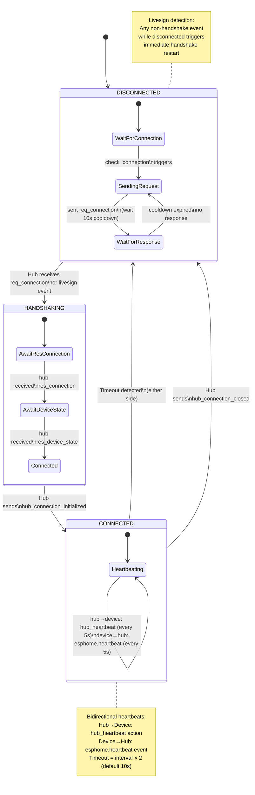

# Communication Overview

[README](../README.md) | [Documentation](README.md) | [Installation](Install.md) | [Configuration](Config.md) | [Panels](panels/README.md) | [FAQ](FAQ.md)

- [Communication Overview](#communication-overview)
  - [Architecture](#architecture)
  - [Handshake Protocol](#handshake-protocol)
    - [Step-by-step](#step-by-step)
    - [From the Hub side (`HAUIConnectionController.process_event()`):](#from-the-hub-side-hauiconnectioncontrollerprocess_event)
    - [From the Device side (ESPHome YAML):](#from-the-device-side-esphome-yaml)
  - [Bidirectional Heartbeats](#bidirectional-heartbeats)
    - [Hub→Device heartbeat](#hubdevice-heartbeat)
    - [Device→Hub heartbeat](#devicehub-heartbeat)
  - [Timeout \& Reconnection](#timeout--reconnection)
    - [Hub-side timeout detection](#hub-side-timeout-detection)
    - [Device-side timeout detection](#device-side-timeout-detection)
    - [Reconnection flow (Livesign detection)](#reconnection-flow-livesign-detection)
    - [Device-side reconnection](#device-side-reconnection)
    - [Connection state change notification](#connection-state-change-notification)
  - [Error Scenarios](#error-scenarios)
    - [ESPHome Native API disconnect](#esphome-native-api-disconnect)
    - [HA restart](#ha-restart)
    - [ESP32 reboot](#esp32-reboot)
    - [Network partition](#network-partition)
  - [State Machine](#state-machine)

## Architecture

```text
┌──────────────┐                    ┌────────────────────────────┐
│              │      UART          │     ESPHome Device         │
│   Nextion    │◄─────────────────►│                            │
│   Display    │                    │  ┌──────────────────────┐  │
│              │                    │  │ Connection Scripts  │  │
└──────────────┘                    │  │ - check_connection  │  │
                                    │  │ - check_hub_connection│  │
                                    │  │ - set_hub_connected │  │
┌───────────────────────────────────┤  └──────────────────────┘  │
│   Hub App (NSPanelHAUI)          │                            │
│                                   │  ESPHome Native API        │
│  ┌─────────────────────────┐      │◄─────────────────────────►│
│  │ HAUIConnectionController│      └────────────────────────────┘
│  │  - 3-state handshake    │
│  │  - Bidirectional HB     │     Client (Display ↔ Device)
│  │  - Timeout monitoring   │     Server (Hub App)
│  └─────────────────────────┘
└───────────────────────────────────┘
         All communication: ESPHome Native API
```

The **device** (ESP32 running ESPHome) talks to the **display** (Nextion) via UART and communicates with the **hub app** (NSPanelHAUI) via ESPHome Native API events.

## Handshake Protocol

The handshake uses a 3-step sequence between hub (`HAUIConnectionController`) and device (ESPHome YAML scripts). Both sides maintain a 3-state machine: `DISCONNECTED → HANDSHAKING → CONNECTED`.

### Step-by-step

```
Device                    Hub
  │                        │
  │     1. req_connection  │
  │───────────────────────►│  (DISCONNECTED → HANDSHAKING on hub)
  │                        │
  │     2. hub_connection_response  │
  │◄───────────────────────│  (SENDING → waiting on device)
  │                        │
  │     3. res_connection  │
  │───────────────────────►│  (hub reads heartbeat_interval)
  │                        │
  │     4. req_device_state│
  │◄───────────────────────│  (device publishes res_device_state)
  │                        │
  │     5. res_device_state│
  │───────────────────────►│  (HANDSHAKING → CONNECTED on hub)
  │                        │
  │     6. hub_connection_initialized  │
  │◄───────────────────────│  (waiting → CONNECTED on device)
  │                        │
  │     7. Bidirectional heartbeats begin  │
  │◄──────────────────────►│
```

### From the Hub side (`HAUIConnectionController.process_event()`):

1. **`req_connection`** (while DISCONNECTED)
   - Hub parses device info from event value
   - Sets state → HANDSHAKING
   - Replies with `hub_connection_response` (includes hub version)
   - → Waits for step 3

2. **`res_connection`** (while HANDSHAKING)
   - Hub parses connection response (heartbeat_interval from device)
   - Adopts device's heartbeat interval if valid
   - Requests device state via `req_device_state`
   - → Waits for step 5

3. **`res_device_state`** (while HANDSHAKING)
   - Hub parses device state JSON
   - Sets state → CONNECTED
   - Sends `hub_connection_initialized` to device
   - Sends `reset_last_interaction` to reset display timeout
   - Starts heartbeat timer (hub→device)
   - Starts timeout monitoring (device→hub)
   - Invokes connection callback

### From the Device side (ESPHome YAML):

1. Device starts in DISCONNECTED state
2. `check_connection` script runs every 100ms:
   - If DISCONNECTED + hub available: sends `req_connection` with 10s cooldown
3. Device receives `hub_connection_response` → sends `res_connection`
4. Device receives `req_device_state` → responds `res_device_state`
5. Device receives `hub_connection_initialized` → sets `hub_connection = true`
6. Device enters CONNECTED state → heartbeats begin

## Bidirectional Heartbeats

Once connected, **both sides independently** send and monitor heartbeats:

| Direction | Mechanism | Default interval | Timeout |
|-----------|-----------|------------------|---------|
| Hub → Device | `hub_heartbeat` action (resets `hub_heartbeat` timestamp on device) | `heartbeat_interval` (5s) | `interval × 2` (10s) |
| Device → Hub | `esphome.heartbeat` event (updates `_last_time` on hub) | `heartbeat_interval` (5s) | `interval × 2` (10s) |

### Hub→Device heartbeat

- Started when state reaches CONNECTED
- Timer fires every `heartbeat_interval` seconds (first at "now+0")
- Calls the `hub_heartbeat` ESPHome action which resets `hub_heartbeat` on the device
- Stopped when state leaves CONNECTED

### Device→Hub heartbeat

- Device publishes `esphome.heartbeat` event when `hub_connection = true`
- Hub's `process_event()` detects heartbeat event → calls `_update_last_time()`
- Timeout checker (`_check_timeout()`) runs every `heartbeat_interval` seconds
- If `time.monotonic() > last_time + interval × factor` → declares timeout

## Timeout & Reconnection

### Hub-side timeout detection

The `_check_timeout()` method runs on a periodic timer:
- Only active when state is CONNECTED
- Compares current monotonic time against `_last_time + max(interval × factor, 10.0)`
- On timeout: logs warning, transitions to DISCONNECTED

### Device-side timeout detection

The `check_hub_connection` script runs every 100ms:
- Only active when `hub_connection = true`
- Compares `millis()/1000` against `hub_heartbeat + interval × 2`
- On timeout: calls `set_hub_connected(false)`

### Reconnection flow (Livesign detection)

Hub's `process_event()` handles any event received while DISCONNECTED:
- If event is NOT `res_connection` or `res_device_state` (i.e., not already part of a handshake):
  - Treats it as a "livesign" - the device is still alive but connection was lost
  - Initiates handshake immediately: → HANDSHAKING, sends `hub_connection_response`
  - Returns early (does NOT fall through to process the same event as a normal event)
- The next expected events (`res_connection`, `res_device_state`) continue the handshake

### Device-side reconnection

The `check_connection` script runs every 100ms:
- Uses static variables to track retry state:
  - `connecting`: true while waiting for handshake response (10s cooldown)
  - `connecting_time`: epoch of last connection request sent
- If DISCONNECTED + hub available + not currently connecting:
  - Sends `req_connection`, sets cooldown
- If cooldown expires without response: resets `connecting` flag to retry

### Connection state change notification

Both sides publish state changes:
- Device: `esphome.connected` event when `connected != prev_connected`
- Hub: `callback_connection(bool)` → `HAUIDevice.set_connected(bool)`

When hub detects CONNECTED → DISCONNECTED:
1. Sends `hub_connection_closed` action to device
2. Stops heartbeat timer
3. Starts tracking `_disconnected_since` for extended-disconnect warnings

When hub detects connection established (HANDSHAKING → CONNECTED):
1. Sends `hub_connection_initialized` action
2. Sends `reset_last_interaction` to reset display timeout
3. Starts heartbeat timer
4. Starts timeout timer
5. Clears `_disconnected_since`

## Error Scenarios

### ESPHome Native API disconnect
- `on_client_disconnected` handler sets `hub_availability = false`
- `on_client_connected` handler sets `hub_availability = true`, triggers `publish_connection_request`
- Hub detects `hub_availability=true` through livesign events

### HA restart
- Hub app restarts fresh with DISCONNECTED state
- Device detects missing hub heartbeats → timeouts → reconnects
- Hub receives `req_connection` from device → completes handshake

### ESP32 reboot
- Device starts fresh with DISCONNECTED
- Hub detects timeout → transitions to DISCONNECTED
- Device boots, sends `req_connection` → clean handshake

### Network partition
- Both sides independently timeout
- Device detects: `check_hub_connection` → `set_hub_connected(false)`
- Hub detects: `_check_timeout` → DISCONNECTED
- Network restores: device sends heartbeat or livesign → handshake re-initiation

## State Machine



## Reading Values from the Display

The hub can request the current value (numeric) or text of any Nextion component
or global variable.  This is used for slider controls (brightness, volume, cover
position, etc.) and anywhere the hub needs to know the display's state without
maintaining a mirror.

### Round-Trip Flow

```
HA Page (Python)                       ESPHome Device                Nextion
─────────────────                      ───────────────               ───────
request_component_value(comp)
  → _request_component_read()
    → send_esphome(REQ_VAL, name)

                                        req_val action
                                          → request_number script
                                            → req_val_component = name
                                            → send: system.resVal=name.val
                                            → res_val.update()

                                                                     reads name.val
                                                                     → system.resVal
                                        res_val sensor on_value
                                          → publish read_response
                                            {name, type:"number", value}

_process_read_response(e)
  → callback(value)
```

The text path is identical but uses `REQ_TXT` → `request_text` script →
`system.resTxt.txt=name.txt` → `res_txt` sensor → `read_response` with
`type:"text"`.

### Python API

#### Requesting reads

**`request_component_value(component: Component)`** — Request a numeric value.
Used by slider pages.  Sends `REQ_VAL` to the device.

**`request_component_text(component: Component)`** — Request a text value.
Sends `REQ_TXT` to the device.

Both accept the component by name via convenience wrappers:

```python
# Without a Component object
self.request_component_value_by_name("hBrightness")
self.request_component_text_by_name("tTitle")
```

#### Registering callbacks

Read responses arrive asynchronously via `esphome.read_response` events.  You
MUST register a callback **before** sending the request so the dispatcher knows
where to route the response:

```python
self.add_read_callback(comp, self._on_value_read)
self.request_component_value(comp)
```

The callback receives a single argument — an `int` for number reads or a `str`
for text reads:

```python
def _on_value_read(self, value: int) -> None:
    self.log(f"Got brightness: {value}")
```

**Without a Component:**

```python
self.add_read_callback_by_name("tTitle", self._on_title_read)
self.request_component_text_by_name("tTitle")
```

#### Slider convenience — `bind_slider()`

The most common pattern is a slider component: register the drag handler, read
the value on release, and dispatch to a handler.  `bind_slider()` does all three:

```python
self.bind_slider(self.COMPONENTS.h_brightness, self._on_brightness)
```

This is equivalent to:

```python
self.on_release(self.COMPONENTS.h_brightness, self._callback_slider_release, drag=True)
self.add_read_callback(self.COMPONENTS.h_brightness, self._on_brightness)
```

The release handler calls `request_component_value()` and the result goes to
`_on_brightness`.

### Single In-Flight Constraint

Only **one** read can be in-flight at a time because the ESP32 has a single
`req_val_component` / `req_txt_component` global pair.  If a second read is
requested while one is pending, it is **silently skipped** with a log message.

The guard expires after `READ_PENDING_TIMEOUT` (2 seconds by default) so a lost
`read_response` event never wedges the system.  Responses that arrive after the
timeout are dropped as stale.

### Touch interaction clearing

When a new touch (`TOUCH_START`) arrives, `_pending_read_request` is cleared
(None).  Any `read_response` that arrives after that is treated as stale and
dropped — the new touch is expected to trigger a fresh read request.

### Pages using the read API

| Page | File | Method |
|------|------|--------|
| Light | `haui/page/light.py` | `bind_slider()` for brightness + color temp |
| Cover | `haui/page/cover.py` | `bind_slider()` for position |
| Media | `haui/page/media.py` | `add_read_callback()` + `request_component_value()` |
| Settings | `haui/page/settings.py` | `bind_slider()` for brightness full/dim |
| Row | `haui/page/row.py` | `add_read_callback()` for row-based slider |
