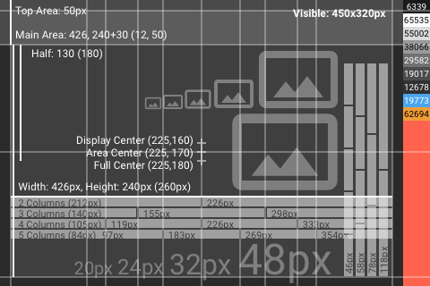
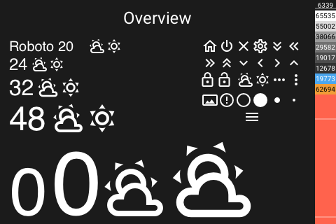

# Design Guidelines

[README](../README.md) | [Documentation](README.md) | [Installation](Install.md) | [Configuration](Config.md) | [Panels](panels/README.md) | [FAQ](FAQ.md)

- [Design Guidelines](#design-guidelines)
  - [Overview](#overview)
  - [Style](#style)
  - [Fonts](#fonts)
  - [Icons](#icons)
  - [Colors](#colors)
  - [Header](#header)

## Overview

## Style

The display is splitted into two areas, a top area and a main area.

The top area is used for navigation and a header.

The main area is used for content.

## Fonts

The font [Roboto](https://github.com/googlefonts/roboto) and [MaterialDesign-Webfont](https://github.com/Templarian/MaterialDesign-Webfont) is being used.

Fonts for text

- **Size 20** - Small Size - All icons / Text
- **Size 24** - Default Size - All icons / Text
- **Size 32** - Big Size - All icons / Text
- **Size 48** - Bigger Size - All icons / Text

Fonts for time / weather

- **Size 96** - Only Limited Icons / Limited Text
- **Size 128** - Only Limited Icons / Limited Text

## Icons

The icons available can be viewed here:

- [Icons Cheatsheet](https://htmlpreview.github.io/?https://raw.githubusercontent.com/happydasch/nspanel_haui/master/docs/cheatsheet.html) for a icon overview

- [Pictogrammers](https://pictogrammers.com/library/mdi/) if you need the char of the source font

## Colors

The display is using these colors.

-  **Background Color**

  **RGB** `#181818` / 0x1b1b1b / [24, 24, 24]
  **RGB565** 6339

-  **Text**

  **RGB** `#dedede` / 0xdcdbdb / [222, 222, 222]
  **RGB565** 57083

- **Text Inactive**

  **RGB** `#717171` / 0x717171 / [113, 113, 113]
  **RGB565** 29582

-  **Text Disabled**

  **RGB** `#313131` / 0x313131 / [49, 49, 49]
  **RGB565** 12678

-  **Component**

  **RGB** `#ffffff` / 0xffffff / [255, 255, 255]
  **RGB565** 65535

-  **Component Active**

  Button Text Action, Active Slider

  **RGB8** `#4ba6ee` / 0x4ba6ee / [75, 166, 238]
  **RGB565** 19773

-  **Component Accent**

  **RGB** `#f09d37` / 0xf09d37 / [240, 157, 55]
  **RGB565** 62694

-  **Component Background**

  **RGB** `#4c4c4c` / 0x4c4c4c / [76, 76, 76]
  **RGB565** 38066

## Header

The header provides 2 function buttons on the left, 2 function buttons on the right and a title.
Outlined icons should be used, use only component_accent color. Only use other colors if really needed.
