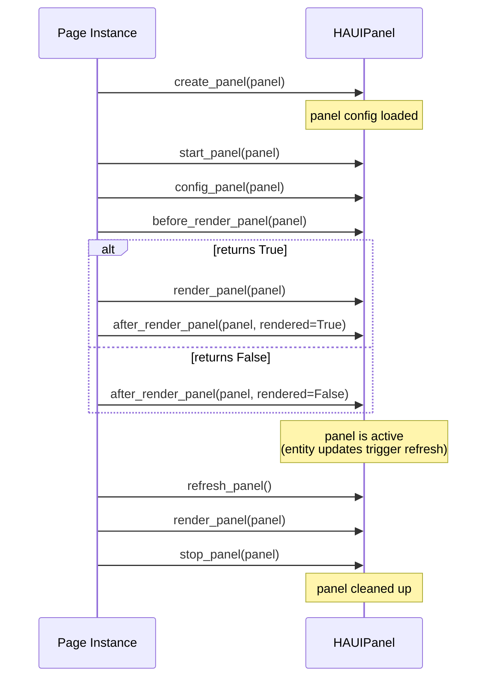
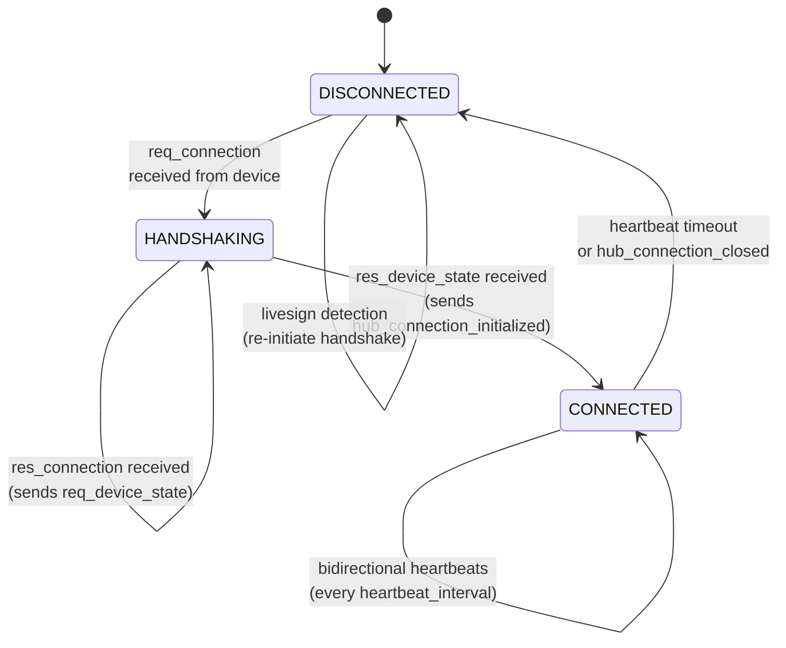

# Hub Component

NSPanelHAUI is the backend that allows to manage home automation devices using the NSPanel.

## Requirements

- Home Assistant with ESPHome integration
- Dependencies are auto-installed by Home Assistant (see `manifest.json`)

## Installation

1. Install the NSPanel HAUI custom integration via HACS or by copying to `custom_components/nspanel_haui/`
2. Add the integration via **Settings → Devices & Services → Add Integration → NSPanel HAUI** (config flow) or configure via `configuration.yaml`
3. Restart Home Assistant

## Structure

The classes are structured as described below.

### Base Component

All parts of haui are based on the `haui.abstract.HAUIBase` class. This class provides some basic functionality. There are more specialized classes, which extend from `HAUIBase`:

- `haui.abstract.HAUIBase`
  Base class with common functionality

- `haui.page.HAUIPage`
  Page representation, this class is used when interacting with the page on the device

### App

`NSPanelHAUI`

The lifetime of the application is:

- initialize
- start
- terminate
- stop

### Config

`haui.abstract.config.HAUIConfig`

The configuration is taken from the Hub app config. This class allows to process the config values and gives access to panels and entities.

### Device

`haui.device.HAUIDevice`

This class represents the whole device.

The lifetime of a device is:

- start
- stop

### Page

`haui.page.HAUIPage`

This class represents a single page on the display.

The lifetime of a page is:

- start_page
- stop_page

### Panel

`haui.abstract.HAUIPanel`

The panel represents a configured page. The panel contains the configuration and entities to use. The configuration values are taken from the config.

The lifetime of a panel is:

- **create_panel**(panel)

page start ..

- **start_panel**(panel)
- **config_panel**(panel)
- **before_render_panel**(panel)
  -> if True, panel can be rendered
  -> if False, panel will not be rendered
  - **render_panel**(panel)
- **after_render_panel**(panel, rendered)
- **stop_panel**(panel)


While a panel is active, it can be refreshed using:

- **refresh_panel()** — re-renders the currently set panel by calling render_panel. This will not be triggered automatically.

### Item

`haui.abstract.HAUIItem`

An item represents a configured entry in a panel. It can wrap a real HA entity
(``HAUIEntity``) or be an internal item (``skip``, ``text``, ``navigate``, ``action``).
Configuration values (name, value, icon, color, state overrides) are taken from the
config and resolved through ``HAUIItem``.

## Connection

The connection between the Hub app and the device is managed by `haui.controller.HAUIConnectionController` using a 3-state machine: `DISCONNECTED → HANDSHAKING → CONNECTED`.

### State Machine



### Bidirectional Heartbeats

Once connected, both sides independently monitor liveness:

- **Hub→Device**: Periodic `hub_heartbeat` action at the device-declared `heartbeat_interval` (default 5s). First heartbeat fires immediately ("now+0"), then every interval.
- **Device→Hub**: `esphome.heartbeat` events update `_last_time` in the controller. Timeout = `interval × overdue_factor` (default 10s).

### Timeout Monitoring

The `_check_timeout()` method runs on a periodic timer (same interval as heartbeats):
- Only active in CONNECTED state
- If `time.monotonic() > _last_time + max(interval × factor, 10.0)`, transitions to DISCONNECTED
- Extended-disconnect warnings log every 60s when state stays DISCONNECTED

### Reconnection (Livesign Detection)

Any event received while in DISCONNECTED (except `res_connection` and `res_device_state`) triggers immediate handshake re-initiation:
1. Sets state → HANDSHAKING
2. Sends `hub_connection_response` with hub version
3. Returns early (the same event is NOT processed further)
4. Subsequent `res_connection` → `res_device_state` complete the handshake

### Connection State Callbacks

On state transitions:
- **CONNECTED**: Sends `hub_connection_initialized`, `reset_last_interaction`, starts timers, invokes `callback_connection(True)`
- **DISCONNECTED** (from CONNECTED): Sends `hub_connection_closed`, stops timers, invokes `callback_connection(False)`

The callback propagates to `HAUIDevice.set_connected()`, which handles navigation (open sys_system on first connect, restore panel on reconnect).

## Navigation

The navigation is kept simple. There are navigateable panels and non-navigateable panels. Panels that are not navigateable will be kept in a stack when opened so that it is possible to return to the last navigateable item.

All navigation related functionality can be found in `haui.controller.HAUINavigationController`.

## Gestures

Supported gestures: swipe_left, swipe_right, swipe_up, swipe_down

There is also support for gesture sequences.

All gesture functionality can be found in `haui.controller.HAUIGestureController`

## Updates

All update functionality can be found in `haui.controller.HAUIUpdateController`

## Events

All events are wrapped in the `haui.abstract.HAUIEvent` class. This class provides basic access to events received via ESPHome.

## Communication

Most of the communication happens by publishing to ESPHome. There are two commands to change the display `send_cmd` and `send_cmds`. It is possible to record all calls to send_cmd of `haui.page.HAUIPage` and to use them together with send_cmds:

```python
# start recording of commands to be sent
self.start_rec_cmd()
...

# call render request for page
self.render_panel(panel)

Execute some commands ...

...
# stop recording of commands to be sent
commands = self.stop_rec_cmd(send_commands=False)
self.send_esphome('send_commands', {'commands': commands})
```

every command that ist sent between `start_rec_cmd` and `stop_rec_cmd` will be stored and returned when `stop_rec_cmd` is being called. By default `stop_rec_cmd` will automatically send the recorded commands.

## Available Pages

The pages represent pages on the nextion displays. The pages interact with the ESP and are the main place where to add code for interaction with the device. All pages are defined in `haui.page.*`. See `haui.page.HAUIPage` for functionality.

## Available Panels

Panels are configured representations of a page. A page can have multiple panels, like the alarm page, which is used for alarm activation and the unlock popup. There can be multiple panels using the same page. All panels can have a custom key defined, which is used for navigation. See [Panels Overview](panels/README.md) for more details about the different panels.
