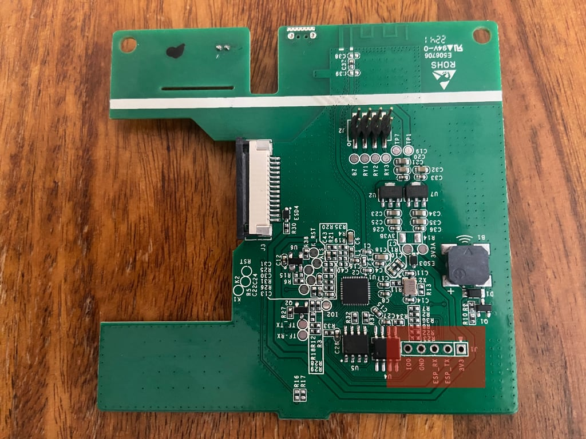

# Installation Guide

[README](../README.md) | [Documentation](README.md) | [Installation](Install.md) | [Configuration](Config.md) | [Panels](panels/README.md) | [FAQ](FAQ.md)

- [Installation Guide](#installation-guide)
  - [Requirements](#requirements)
  - [1. Step: Preparations](#1-step-preparations)
  - [2. Step: Install ESPHome](#2-step-install-esphome)
  - [3. Step: Install AppDaemon App](#3-step-install-appdaemon-app)
  - [4. Step: Configuration for AppDaemon](#4-step-configuration-for-appdaemon)
  - [5. Step: Install TFT File](#5-step-install-tft-file)
  - [Finished](#finished)

## Requirements

HomeAssistant needs to provide following applications:

- ESPHome
- AppDaemon
- A MQTT Broker

Please install all requirements before continuing.

## 1. Step: Preparations

It is neccessary to flash the panel once with ESPHome.

To be able to flash the panel the first time the device needs to be opened and connected via a USB-UART-Adapter.

- Unscrew the backside of the panel
  

- Release the display cable holder
  

- Panel overview, connect cables
  

- Connected cables, GND to IO0, flashing mode**
  

## 2. Step: Install ESPHome

With the prepared and connected device it is now possible to install ESPHome on it.

- Get config for ESPHome

  The configuration can be found in `device/install.yaml`

  copy the content of this file into esphome and adjust the values accordingly. See below for an more detailed explaination of the configuration values.

- Create new device

  Create a new device in ESPHome. Set the device name to the hostname of the device. If you want to access. By default the config is using nspanel-haui which can be accessed at <http://nspanel-haui.local>

  
  

- Replace configuration

  Store the ota password and encryption key and replace the exisiting config with the config from [device/install.yaml](https://github.com/happydasch/nspanel_haui/blob/master/device/install.yaml)

  

- Edit configuration

  Only substitutions needs to be edited.
  Either use a secrets.yaml file or set the configuration values directly in this file.

  The name of the device can be set with `name`, `mqtt_name` and `friendly_name`

  - name: host- and device name
  - mqtt_name: device name for mqtt
  - friendly_name: friendly name of device

  Some credentials needs to be provided:

  - MQTT IP, Username and Password `mqtt_ip`, `mqtt_username`, `mqtt_password`
  - Wifi SSID and Password for autoconnect `wifi_ssid`, `wifi_password`
  - Web Access Login Details `web_username`, `web_password`
  - OTA Password and API Encryption Key `ota_password`, `api_encryption_key`

  

- Install configuration

  When the configuration is done, install the configuration on the device.

  Select Plug into this computer if the device is connected and your broswer supports it or select Manual download to get the binary file `nspanel_haui.bin`.

- Optional: Flash via Web [https://web.esphome.io/](https://web.esphome.io/)

  Open firmware file `nspanel_haui.bin` and click on Install

  Wait until finshed
  

  Successfully flashed, disconnect and put everything back together again.
  

## 3. Step: Install AppDaemon App

Now that the device is prepared, the AppDaemon app can be activated. Install manually by copying the `apps/nspanel_haui` folder on the home assistant server or install via HACS.

- Install AppDaemon on Server

  Copy the folder `nspanel_haui` to `appdaemon/apps/`.

- Install AppDaemon using HACS

This needs to be done only once.

## 4. Step: Configuration for AppDaemon

Edit `addon_configs/a0d7b954_appdaemon/apps/apps.yaml` and create the config for AppDaemon.

- Add configuration for panel

  Open and edit the file `addon_configs/a0d7b954_appdaemon/apps/apps.yaml` for more details about the configuration file and available options see [Configuration Details](Config.md).

  See [Config Examples](Example_Config.md) for some sample configurations.

## 5. Step: Install TFT File

The display needs a custom interface which is provided in a TFT file. The file will automatically be installed on the display when the Device connects to the AppDaemon App.

The installation process can also be executed manually. See [Nextion Display](Nextion.md) for details.

## Finished

To install more devices just use unique names. The process remains the same for multiple devices.

See [Documentation](README.md) for more details.
