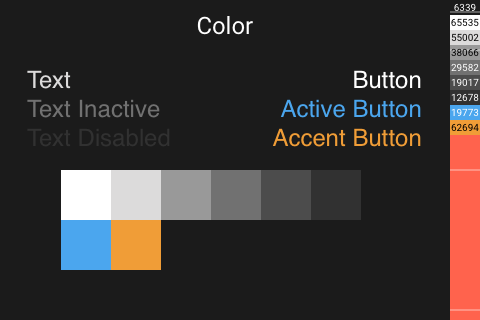

# Nextion Overview

- [Nextion Overview](#nextion-overview)
  - [Style](#style)
  - [Fonts](#fonts)
  - [Colors](#colors)
  - [How to edit the HMI file](#how-to-edit-the-hmi-file)

## Style

The display is splitted into two areas, a top area and a main area.

The top area is used for navigation and a header.

The main area is used for content.

The font [Roboto](https://github.com/googlefonts/roboto) and [MaterialDesign-Webfont](https://github.com/Templarian/MaterialDesign-Webfont) is being used.

- [Cheatsheet](https://htmlpreview.github.io/?https://raw.githubusercontent.com/happydasch/nspanel_haui/master/docs/cheatsheet.html) for a icon overview

- [Pictogrammers](https://pictogrammers.com/library/mdi/) if you need the char of the source font

## Fonts

Fonts for text

- **Size 24** - All icons / Text
- **Size 32** - All icons / Text
- **Size 48** - All icons / Text

Fonts for time / weather

- **Size 96** - Only Limited Icons / Limited Text
- **Size 128** - Only Limited Icons / Limited Text

## Colors

The display is using these colors.

-  **Background Color**

  **RGB** `#181818` / 0x1b1b1b
  **RGB565** 6339

-  **Text**

  **RGB** `#dedede` / 0xdcdbdb
  **RGB565** 57083

- **Text Inactive**

  **RGB** `#717171` / 0x717171
  **RGB565** 29582

-  **Text Disabled**

  **RGB** `#313131` / 0x313131
  **RGB565** 12678

-  **Component**

  **RGB** `#ffffff` / 0xffffff
  **RGB565** 65535

-  **Component Active**

  Button Text Action, Active Slider

  **RGB8** `#4ba6ee` / 0x4ba6ee
  **RGB565** 19773

-  **Component Accent**

  **RGB** `#f09d37` / 0xf09d37
  **RGB565** 62694

-  **Component Background**

  **RGB** `#4c4c4c` / 0x4c4c4c
  **RGB565** 38066

## How to edit the HMI file

To edit the HMI file, no special care is needed. Following are some helpful infos. The HMI is used mostly to design the interface but does not need any special code. Only on a page based lifetime of events should be done on the display. If possible, the logic should be placed in the AppDaemon App.

All pages need to send a `sendme` in `Preinitialize`. This is needed to know of a page change event.

Prepare the page in the `Preinitialize` event because the AppDaemon App cannot control the display at this stage. Only after a page is shown, it is possible to change anything or interact with it.

If you want to process any click events, you need to enable `Send Component ID` on the event to be used.

If you want to interact with any component on the display, the component id and objectname is required. They are being used and are defined in the AppDaemon App.

When changing order of components on a page, be aware, that the id of the components will change.
