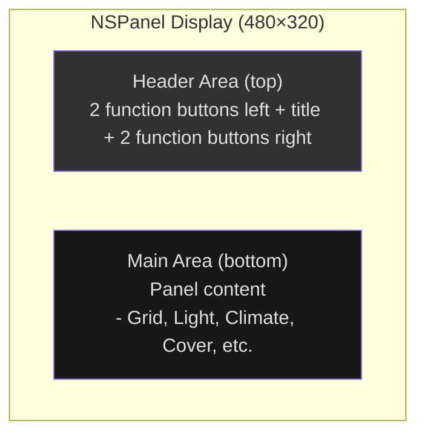

# Design Guidelines

## Overview

You can download a [template file](assets/panel.psd) in PSD Format.

## Style

The display is splitted into two areas, a top area and a main area.

The top area is used for navigation and a header.

The main area is used for content.

The 480×320 display is split into two zones:



## Fonts

The font [Roboto](https://github.com/googlefonts/roboto) and [MaterialDesign-Webfont](https://github.com/Templarian/MaterialDesign-Webfont) is being used.

Fonts for text

- **Size 20** - Small Size - All icons / Text
- **Size 24** - Default Size - All icons / Text
- **Size 32** - Big Size - All icons / Text
- **Size 48** - Bigger Size - All icons / Text

Fonts for time / weather

- **Size 96** - Only Limited Icons / Limited Text
- **Size 128** - Only Limited Icons / Limited Text

## Icons

The icons available can be viewed here:

- [Icons Cheatsheet](https://htmlpreview.github.io/?https://raw.githubusercontent.com/happydasch/nspanel_haui/master/docs/cheatsheet.html) for a icon overview

- [Pictogrammers](https://pictogrammers.com/library/mdi/) if you need the char of the source font

## Colors

The display is using these colors.

-  **Background Color**

  **RGB** `#181818` / 0x1b1b1b / [24, 24, 24]
  **RGB565** 6339

-  **Text**

  **RGB** `#dedede` / 0xdcdbdb / [222, 222, 222]
  **RGB565** 57083

- **Text Inactive**

  **RGB** `#717171` / 0x717171 / [113, 113, 113]
  **RGB565** 29582

-  **Text Disabled**

  **RGB** `#313131` / 0x313131 / [49, 49, 49]
  **RGB565** 12678

-  **Component**

  **RGB** `#ffffff` / 0xffffff / [255, 255, 255]
  **RGB565** 65535

-  **Component Active**

  Button Text Action, Active Slider

  **RGB8** `#4ba6ee` / 0x4ba6ee / [75, 166, 238]
  **RGB565** 19773

-  **Component Accent**

  **RGB** `#f09d37` / 0xf09d37 / [240, 157, 55]
  **RGB565** 62694

-  **Component Background**

  **RGB** `#4c4c4c` / 0x4c4c4c / [76, 76, 76]
  **RGB565** 38066

## Header

The header provides 2 function buttons on the left, 2 function buttons on the right and a title.
Outlined icons should be used, use only component_accent color. Only use other colors if really needed.

## Panel Creation Workflow

Creating a new display panel type involves a pipeline from design through implementation, registration, and documentation. The steps below describe the end-to-end process.

### Step 1 — Design in Nextion IDE

Start by editing `nextion/nspanel_haui.HMI` in the Nextion Editor:

1. **Create the page layout** — The display is 480×320 pixels. Reserve the top header zone for navigation; the main area below it is for panel content.
2. **Assign widget IDs and names** — Each interactive or data-bound widget needs a unique ID (starting from 0 or 1 per page) and a descriptive name (e.g., `tTitle`, `bUp`, `hVertPos`).
3. **Add `sendme` in the Preinitialize Event** — The page must send a `sendme` command in its Preinitialize Event so the ESPHome firmware knows when the page is ready. See [Nextion Component](nextion.md) for details.
4. **Use `Send Component ID`** (recommended) — Enable this on touch-enabled widgets so the event includes the widget's component ID in the payload, reducing manual touch-event parsing in Python.

See [Nextion Component](nextion.md) for more about display-level operations, `sendme`, and touch event handling.

### Step 2 — HMI Inspection

Generate a readable text dump of the HMI file to map Nextion widgets to Python `Component` entries:

```bash
python scripts/nextion2text/Nextion2Text.py \
    -i nextion/nspanel_haui.HMI \
    -o ref_src/nextion-out-visual \
    -d -s -p visual
```

- `-i` — path to the `.HMI` file
- `-o` — output folder (one `.txt` file per Nextion page); `ref_src/` is git-ignored
- `-d` — clear the output folder first so stale files don't linger
- `-s` — also write a stats summary file (component/event counts)
- `-p visual` — include visual properties (position, size, colors) needed for preview layout

Each generated file lists the page's widgets by ID and name, plus event code. Use these to build the `Component(id, "name")` entries for your Python page class.

### Step 3 — Python Page Class

Create a page class in `custom_components/nspanel_haui/haui/page/<yourpanel>.py`:

```python
from __future__ import annotations

from ..abstract.component import Component, ComponentRegistry
from ..abstract.haui_page import HAUIPage
from ..abstract.haui_panel import HAUIPanel
from ..mapping.descriptor import PageDescriptor, PageOption, _


class YourPanelPage(HAUIPage):
    DESCRIPTOR = PageDescriptor(
        type_key="yourpanel",
        page_name="yourpanel",
        page_id=42,                        # unique numeric page ID
        label=_("Your Panel"),
        description=_("Description of your panel."),
        icon="mdi:your-icon",
        options=[
            PageOption(
                key="some_option",
                kind="text",
                description=_("Some configurable option."),
            ),
        ],
    )

    components = HAUIPage.components.merge(
        title=Component(2, "tTitle"),
        some_widget=Component(7, "bSomeWidget"),
        # ... map all widgets from the HMI dump
    )

    def prepare(self) -> None:
        """Set instance attribute defaults. Called during __init__."""
        self._some_state: bool = False

    def start_panel(self, panel: HAUIPanel) -> None:
        """Register callbacks, create items, save state."""
        super().start_panel(panel)

    def render_panel(self, panel: HAUIPanel) -> None:
        """Send display commands. Use rec_cmd for batching."""
        with self.rec_cmd:
            self.set_component_text(self.components.title, "Hello")
            self.set_component_value(self.components.some_widget, 1)

    def _stop_panel(self, panel: HAUIPanel) -> None:
        """Cleanup: unregister callbacks, restore state.
        Do NOT call super() — stop_panel() calls this automatically."""
```

Key lifecycle hooks (see [Hub Component](hub.md) for the full lifecycle):

| Hook | Purpose |
|------|---------|
| `prepare()` | Set instance attribute defaults |
| `start_panel(panel)` | Register callbacks, create items |
| `config_panel(panel)` | Auto button setup (rarely overridden) |
| `before_render_panel(panel)` | Return `False` to abort rendering |
| `render_panel(panel)` | Send display commands |
| `after_render_panel(panel, rendered)` | Post-render actions |
| `_stop_panel(panel)` | Cleanup (override this instead of `stop_panel`) |

Use the `rec_cmd` context manager to batch display commands:

```python
with self.rec_cmd:
    self.set_component_text(self.components.title, "Hello")
    self.set_component_value(self.components.some_widget, 42)
    self.send_cmd("click button1,1")
```

Commands within a batch are deduplicated — only the last write to each target is sent.

### Step 4 — Panel Mapping Registration

Register the new page class in `custom_components/nspanel_haui/haui/mapping/panel.py`:

1. **Import** the class at the top of the file.
2. **Append** it to the `_page_classes` list:

```python
from ..page.yourpanel import YourPanelPage

_page_classes: list[type] = [
    # ... existing entries ...
    YourPanelPage,
]
```

If the panel has a popup variant, add a `popup_<name>` alias in the `popup_aliases` dict in the same file.

### Step 5 — Preview Renderer

The editor grid view shows a visual preview of each panel. Add one for your new type.

**Generate a stub:**
```bash
python scripts/gen_preview/gen_preview.py --type yourpanel
```

This creates `frontend/previews/yourpanel.js` with a placeholder renderer that lists all Nextion components and panel options as comments.

**Fill in the visual layout** — edit `frontend/previews/yourpanel.js` to compose actual visual content using primitives from `primitives.js` and styles from `styles/preview/common.js`. See existing renderers (e.g., `grid.js`, `clock.js`) as reference.

**Add preview CSS** (if needed) — create `frontend/styles/preview/yourpanel.js` exporting a Lit `css` tagged template, then import and reference it in `frontend/styles/panel-preview-styles.js`.

**Register** — the generator adds the import and `registerPanelPreview` line in `frontend/panel-previews.js` automatically. If creating manually, add:

```javascript
import { renderYourPanelPreview } from './previews/yourpanel.js';
// ... then in the registration block:
registerPanelPreview('yourpanel', renderYourPanelPreview);
```

**Verify coverage:**
```bash
python scripts/gen_preview/gen_preview.py --check-missing
```

### Step 6 — Panel Documentation

Create a documentation file at `docs/panels/panel_yourpanel.md`:

```markdown
---
title: Your Panel
description: Description of your panel for NSPanel HAUI
---

# Your Panel

## Overview

Brief description of what this panel does.

## Configuration

| Option | Type | Description |
|--------|------|-------------|
| `some_option` | text | Some configurable option |

## Display Layout

Describe the layout and what each widget displays.

## Behavior

Describe any interactive behavior, gestures, or special states.
```

Add the new panel to the overview table in `docs/panels/README.md` and optionally to the index in `docs/README.md`. Consider adding an SVG preview to `assets/previews/` for the README table.

### Step 7 — Translations

After adding any `t()` / `host._t()` (frontend JS), `self.translate()` (Python), or `_()` (descriptor) calls, run the extraction script:

```bash
python scripts/translations/extract_translations.py
```

This scans Python and JavaScript source files for translatable string-literal calls, then:

- **Adds** missing keys to all `haui/locale/*.json` files (English text as the value in `en.json`, empty string in other languages)
- **Removes** keys no longer referenced anywhere
- **Prints** a summary of added/removed keys per language file

Fill in the empty values for non-English locale files, then commit the updated locale files together with your code change.

### Step 8 — Compile TFT

The compiled display firmware (`nextion/nspanel_haui.tft`) is a **release asset**, not committed with every code change. After finalising the HMI design:

1. Open `nextion/nspanel_haui.HMI` in the Nextion Editor.
2. Compile and export the `.tft` file to `nextion/nspanel_haui.tft`.
3. Upload it to the device via the **Update Display** service or button in Home Assistant.

See [Services Reference](services.md) for TFT upload instructions.

### Summary of Files to Create or Modify

| Step | File(s) | Action |
|------|---------|--------|
| 1 | `nextion/nspanel_haui.HMI` | Edit in Nextion IDE |
| 2 | — | Run `nextion2text` to inspect widget IDs |
| 3 | `custom_components/nspanel_haui/haui/page/<yourpanel>.py` | **Create** |
| 4 | `custom_components/nspanel_haui/haui/mapping/panel.py` | Edit (import + register) |
| 5 | `frontend/previews/<yourpanel>.js` | **Create** (or use `gen_preview.py`) |
| 5 | `frontend/panel-previews.js` | Edit (import + register) |
| 5 | `frontend/styles/preview/<yourpanel>.js` | **Create** (optional, if custom CSS needed) |
| 5 | `frontend/styles/panel-preview-styles.js` | Edit (optional) |
| 6 | `docs/panels/panel_<yourpanel>.md` | **Create** |
| 6 | `docs/panels/README.md` | Edit (add to overview) |
| 7 | `haui/locale/*.json` | Run `extract_translations.py`, fill in blanks |
| 8 | `nextion/nspanel_haui.tft` | Compile and upload as release asset |

