# Panel Overview

NSPanel HAUI supports **13 panel types** plus **system panels** and **popups**. Panels are categorized by purpose:

- **Entity Controls** — Control a single Home Assistant entity (light, climate, cover, etc.)
- **Multi-Entity** — Display and control multiple entities at once
- **Screensavers** — Full-screen displays for idle/sleep mode
- **Utility** — Special-purpose panels (timer, QR, alarm)
- **System** — Always-available built-in panels (no configuration needed)

---

## Screensaver Panels

Panels that can be used as screensavers / idle display. These panels do not show navigation by default.

| Preview | Panel | Type | Description |
|---------|-------|------|-------------|
| <a href="panel_weather.md">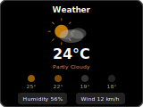</a> | [Weather](panel_weather.md) | `weather` | Weather forecast, time/date, optional background images. Supports info items and entity buttons. |
| <a href="panel_clock.md">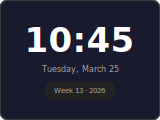</a> | [Clock](panel_clock.md) | `clock` | Large time/date display with optional weather, background, and entity buttons. |
| <a href="panel_clocktwo.md">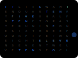</a> | [ClockTwo](panel_clocktwo.md) | `clocktwo` | Minimalist clock showing time as written text (e.g., "twelve thirty-four"). |

---

## Multi-Entity Panels

Panels that show multiple entities in a navigation-enabled layout.

| Preview | Panel | Type | Description |
|---------|-------|------|-------------|
| <a href="panel_grid.md">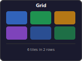</a> | [Grid](panel_grid.md) | `grid` | Up to 6 entities arranged in a scrollable grid. Color overrides, power buttons. |
| <a href="panel_row.md">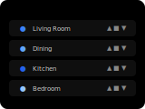</a> | [Row](panel_row.md) | `row` | Up to 5 entities in a horizontal row. Compact icon-focused layout. |

---

## Entity Control Panels

Single-entity control panels with full feature support.

| Preview | Panel | Type | Description |
|---------|-------|------|-------------|
| <a href="panel_light.md">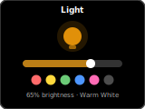</a> | [Light](panel_light.md) | `light` | Full light control: brightness, color temperature, RGB color wheel, effects. |
| <a href="panel_media.md">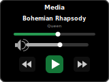</a> | [Media](panel_media.md) | `media` | Media player controls: play/pause, volume, queue. Supports TV, speakers, receivers. |
| <a href="panel_vacuum.md">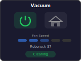</a> | [Vacuum](panel_vacuum.md) | `vacuum` | Robot vacuum controls: start/stop, return home, fan speed, locate. Up to 6 secondary items. |
| <a href="panel_cover.md">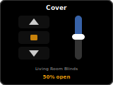</a> | [Cover](panel_cover.md) | `cover` | Cover/blind control: open, stop, close, vertical position slider. |
| <a href="panel_climate.md">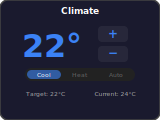</a> | [Climate](panel_climate.md) | `climate` | HVAC control: temperature setpoint, modes (heat/cool/auto), fan speed, swing, presets. |

---

## Utility Panels

Special-purpose panels for non-entity functions.

| Preview | Panel | Type | Description |
|---------|-------|------|-------------|
| <a href="panel_timer.md">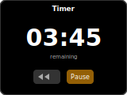</a> | [Timer](panel_timer.md) | `timer` | Local countdown timer with start/pause/stop. Display-local time, no HA entity needed. |
| <a href="panel_qr.md">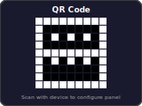</a> | [QR Code](panel_qr.md) | `qr` | Display QR codes for Wi-Fi details, URLs, or custom text. |
| <a href="panel_alarm.md">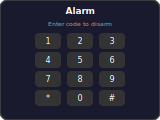</a> | [Alarm](panel_alarm.md) | `alarm` | Numeric keypad for alarm code entry. Arm/disarm with mode buttons. |

---

## Popups

Overlay panels used for temporary interactions.

| Popup | Type | Description |
|-------|------|-------------|
| [Unlock](popup_unlock.md) | `popup_unlock` | PIN-protected unlock for locked panels. Built on `AlarmPage`. |
| [Notify](popup_notify.md) | `popup_notify` | Ad-hoc notification popup with optional action buttons. |
| [Select](popup_select.md) | `popup_select` | Selection list popup for choosing values (fan speeds, presets, etc.). |

Popup variants of entity panels (`popup_light`, `popup_media_player`, `popup_vacuum`, `popup_climate`, `popup_timer`, `popup_cover`) mirror their main panel layout.

---

## System Panels

Always available, no configuration needed.

| Panel | Type | Description |
|-------|------|-------------|
| [Blank](panel_blank.md) | `sys_blank` | Blank/empty panel used during sleep mode. |
| [System](panel_system.md) | `sys_system` | Loading/error panel. Automatically shown when the device loses connection. |
| [Settings](panel_settings.md) | `sys_settings` | Device settings panel (brightness, dimming, sounds, etc.). |
| [About](panel_about.md) | `sys_about` | Device and version information panel. |
