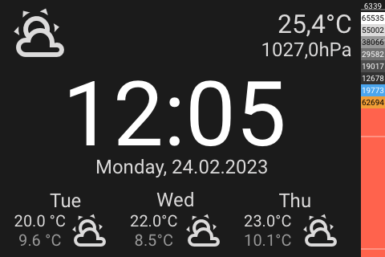

# Panel Overview

[README](../../README.md) | [Documentation](../README.md) | [Installation](../Install.md) | [Configuration](../Config.md) | [Panels](README.md) | [FAQ](../FAQ.md)

- [Panel Overview](#panel-overview)
  - [Special Panels](#special-panels)
    - [Panel Weather `weather`](#panel-weather-weather)
    - [Panel Clock `clock`](#panel-clock-clock)
  - [Entities Panels](#entities-panels)
    - [Panel Grid `grid`](#panel-grid-grid)
    - [Panel Row `row`](#panel-row-row)
    - [Panel Column `column`](#panel-column-column)
    - [Panel Split `split`](#panel-split-split)
  - [Main Panels](#main-panels)
    - [Panel Light `light`](#panel-light-light)
    - [Panel Thermo  `thermo`](#panel-thermo--thermo)
    - [Panel Media `media`](#panel-media-media)
    - [Panel QR-Code `qr`](#panel-qr-code-qr)
    - [Panel Alarm `alarm`](#panel-alarm-alarm)
    - [Panel Timer `timer`](#panel-timer-timer)
  - [Other Panels](#other-panels)
    - [Popup Unlock  `popup_unlock`](#popup-unlock--popup_unlock)
    - [Popup Notify `popup_notify`](#popup-notify-popup_notify)
    - [Popup Select  `popup_select`](#popup-select--popup_select)
  - [System](#system)
    - [Panel Blank `sys_blank`](#panel-blank-sys_blank)
    - [Panel System `sys_system`](#panel-system-sys_system)
    - [Panel Settings `sys_settings`](#panel-settings-sys_settings)
    - [Panel About `sys_about`](#panel-about-sys_about)

## Special Panels

Special Panels without navigation. Can be used as a screensaver.

### [Panel Weather](panel_weather.md) `weather`

Provides a display with weather details and time / date.

### [Panel Clock](panel_clock.md) `clock`

Provides a display with time / date and weather details.

## Entities Panels

Panels with navigation. For showing entities.

### [Panel Grid](panel_grid.md) `grid`

  Panel with 6 entities in a grid.

  

### [Panel Row](panel_row.md) `row`

  Panel with 5 entities in rows.

  

### [Panel Column](panel_column.md) `column`

  Panel with 5 entities in columns.

  

### [Panel Split](panel_split.md) `split`

  Split panel with 3+5 entities.

  

## Main Panels

Panels with navigation. Main Display Elements.

### [Panel Light](panel_light.md) `light`

  Panel to control a light entity.

  

### [Panel Thermo](panel_thermo.md)  `thermo`

  Thermostat control panel.

  

### [Panel Media](panel_media.md) `media`

  Media control panel.

  

### [Panel QR-Code](panel_qr.md) `qr`

  QR-Code panel for Wifi Details or other informations / urls.

  

### [Panel Alarm](panel_alarm.md) `alarm`

  Alarm panel with a keypad.

  

### [Panel Timer](panel_timer.md) `timer`

  Timer panel.

  

## Other Panels

Different panels.

### [Popup Unlock](popup_unlock.md)  `popup_unlock`

  Popup for locking and unlocking panels.

  

### [Popup Notify](popup_notify.md) `popup_notify`

  Popup for notifications.

  

### [Popup Select](popup_select.md)  `popup_select`

  Popup for selecting values.

  

## System

System panels. The system panels are always available and there is no need to configure them.

### [Panel Blank](panel_blank.md) `sys_blank`

  Blank panel is used for sleeping.

  

### [Panel System](panel_system.md) `sys_system`

  System panel is used for loading, when loosing connection, this panel will be automatically set if the device looses connection.

  

### [Panel Settings](panel_settings.md) `sys_settings`

  System panel for device settings.

  

### [Panel About](panel_about.md) `sys_about`

  System panel for about details.

  
