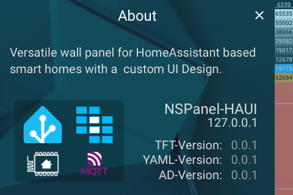

# Panel About

[< All Panels](README.md) | [Configuration](../Config.md) | [FAQ](../FAQ.md)

- [Panel About](#panel-about)
  - [Visualization](#visualization)
  - [About](#about)
  - [Config](#config)

## Visualization



## About

`type: system_about`

`key: sys_about`

The about panel displays informations about the panel and app. It shows the version of the TFT-File, YAML-File and the AppDaemon App Version. Also the IP is being displayed.


Displays:

- IP Address
- Version of TFT File
- Version of YAML File
- Version of AppDaemon

**This panel a system panel and should not be used in the configuration.**

## Config

```yaml
# No config available
```
