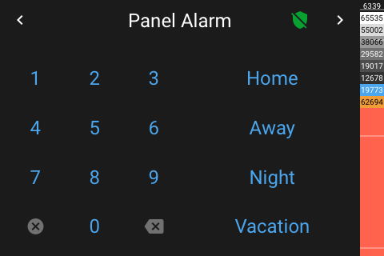
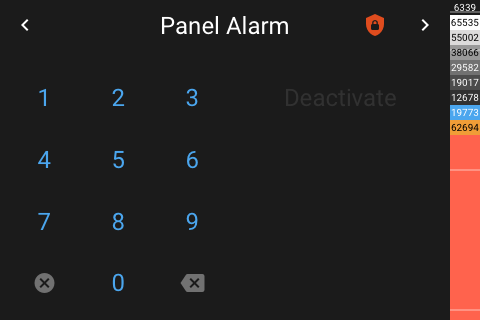
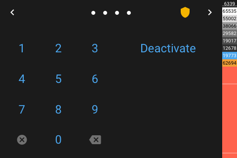

# Panel Alarm

[< All Panels](README.md) | [Configuration](../Config.md) | [FAQ](../FAQ.md)

- [Panel Alarm](#panel-alarm)
  - [Visualization](#visualization)
  - [About](#about)

## Visualization

Panel with armed alarm:

Unarming armed alarm:

## About

`type: alarm`
