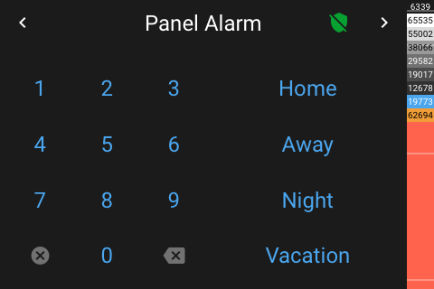
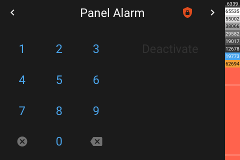
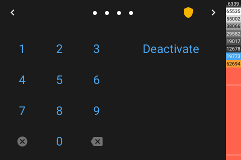

# Panel Alarm

[< All Panels](README.md) | [Configuration](../Config.md) | [FAQ](../FAQ.md)

- [Panel Alarm](#panel-alarm)
  - [About](#about)
  - [Config](#config)
  - [Screens](#screens)

## About

`type: alarm`

The alarm panel provides a numeric keypad (0–9, CLR, DEL) for entering an alarm code. It is used as the base for the unlock panel and is intended to be used with alarm/security integrations.

## Config

```yaml
panels:
  - type: alarm
```

## Screens



Panel with armed alarm:



Unarming armed alarm:


