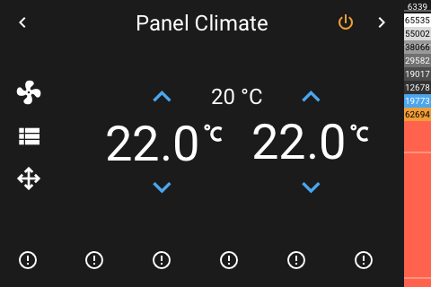

# Panel Climate

[< All Panels](README.md) | [Configuration](../Config.md) | [FAQ](../FAQ.md)

- [Panel Climate](#panel-climate)
  - [About](#about)
  - [Popup](#popup)
  - [Config](#config)
    - [HVAC Modes `hvac_modes`](#hvac-modes-hvac_modes)
  - [Screens](#screens)

## About

`type: climate`

The climate entity panel allows to control a single climate entity.

All available hvac modes will be shown as icons at the bottom of the panel.

## Popup

`type: popup_climate`

`key: popup_climate_key`

## Config

```yaml
panels:
  - type: climate
    entity: climate.example_climate
    hvac_modes: None
```

### HVAC Modes `hvac_modes`

Override the supported hvac modes by providing a list with hvac mode names using `hvac_modes`.

```yaml
panels:
  - type: climate
    entity: climate.example_climate
    hvac_modes: ["off", "heat", "cool"]
```

## Screens





