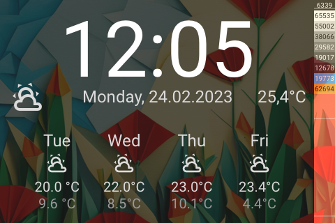

# Panel Clock

[< All Panels](README.md) | [Configuration](../Config.md) | [FAQ](../FAQ.md)

- [Panel Clock](#panel-clock)
  - [About](#about)
  - [Config](#config)
    - [Background](#background)
    - [Show weather](#show-weather)
    - [Show temperature](#show-temperature)
  - [Screens](#screens)

## About

`type: clock`

The clock panel shows a big clock and uses 4 entities for the weather conditions display.

## Config

```yaml
panels:
  - type: clock
    entity: weather.home
    background: default
    show_weather: True
    show_temp: True
```

### Background

The clock panel can have different background images. To set a background use the `background` param.

Possible values:

- default
- spring
- summer
- autumn
- winter
- dog_1
- dog_2
- cat

Dynamic background values are possible using HomeAssistant templates.

`background: template:{...}`

The return value should match a background name.

### Show weather

The main weather icon can be hidden by setting `show_weather` to `False`

### Show temperature

The main temperature text can be hidden by setting `show_temp` to `False`

## Screens



