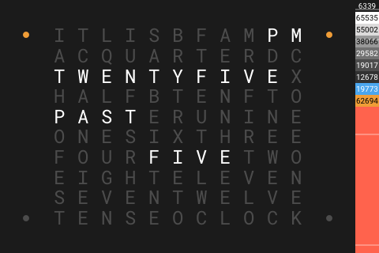

# Panel ClockTwo

[< All Panels](README.md) | [Configuration](../Config.md) | [FAQ](../FAQ.md)

- [Panel ClockTwo](#panel-clocktwo)
  - [About](#about)
  - [Config](#config)
    - [Background](#background)
    - [Change language](#change-language)
    - [Custom colors](#custom-colors)
    - [Show AM/PM](#show-ampm)
    - [Show Intro Text](#show-intro-text)
    - [Show Notifications](#show-notifications)
  - [Screens](#screens)

## About

`type: clocktwo`

The clocktwo panel shows the current time by using written text on the display.

## Config

```yaml
panels:

  # clocktwo panel
  - type: clocktwo

  # clocktwo panel with a different background
  - type: clocktwo
    background: dog_1

  # clocktwo panel with a background and with custom colors
  - type: clocktwo
    clock_language: en
    background: dog_1
    off_color:
    letter_color:
    special_color:
```

### Background

The clocktwo panel can have different background images. To set a background use the `background` param.

Possible values:

- default
- spring
- summer
- autumn
- winter
- dog_1
- dog_2
- cat

Dynamic background values are possible using HomeAssistant templates.

`background: template:{...}`

The return value should match a background name.

### Change language

The clocktwo panel supports multiple languages. Set the language by using `clock_language`.

Supported languages:

- `en` English
- `de` German
- `pl` Polish

### Custom colors

The colors of the clocktwo can be changed:

Supported colors:

- `off_color`
- `letter_color`
- `special_color`

### Show AM/PM

AM/PM can be enabled by setting `show_ampm` to `True`

### Show Intro Text

The intro text can be omitted by setting `show_intro_text` and `show_intro_text_full_hour` to `False`

- `show_intro_text` Show intro text always (Default: True)
- `show_intro_text_full_hour` Show intro text on full hours (Default: False)

setting `show_ampm` to `True`

### Show Notifications

The notifications icon can be hidden by setting `show_notifications` to `False`

## Screens




