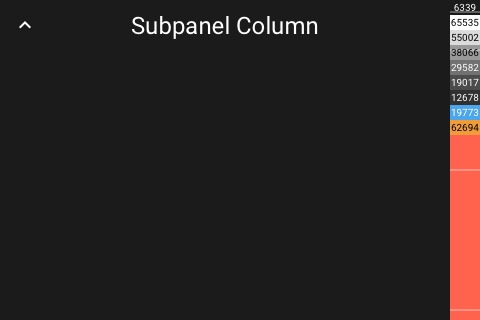
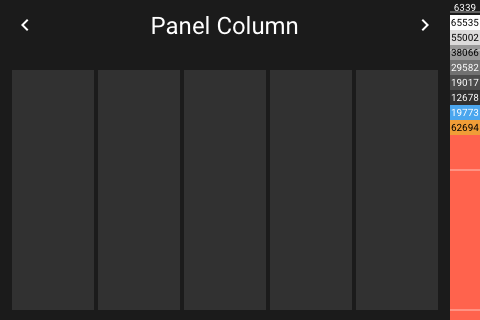

# Panel Column

[< All Panels](README.md) | [Configuration](../Config.md) | [FAQ](../FAQ.md)

- [Panel Column](#panel-column)
  - [About](#about)
  - [Config](#config)
  - [Screens](#screens)

## About

`type: column`

Shows entities in columns.

This panel can be also used to organize panels and subpanels.

## Config

```yaml
panels:

```

## Screens




