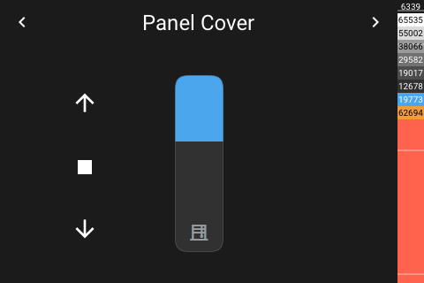
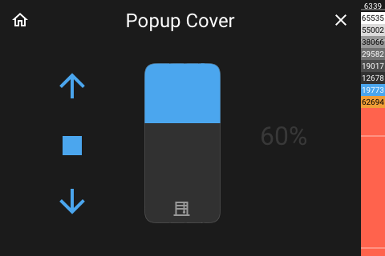

# Panel Cover

[< All Panels](README.md) | [Configuration](../Config.md) | [FAQ](../FAQ.md)

- [Panel Cover](#panel-cover)
  - [About](#about)
  - [Popup](#popup)
  - [Config](#config)
  - [Screens](#screens)

## About

`type: cover`

The cover entity panel allows to control a single cover entity. Open, stop, and close buttons are shown based on the features supported by the entity. A vertical position slider is shown when the entity supports `set_position`.

## Popup

`type: popup_cover`

`key: popup_cover`

## Config

```yaml
panels:
  - type: cover
```

## Screens




Popup:


