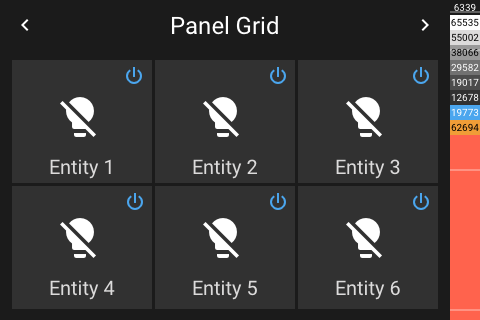

# Panel Grid

[< All Panels](README.md) | [Configuration](../Config.md) | [FAQ](../FAQ.md)

- [Panel Grid](#panel-grid)
  - [About](#about)
  - [Config](#config)
    - [Background Color Mode `back_color_mode`](#background-color-mode-back_color_mode)
    - [Background Color Seed `back_color_seed`](#background-color-seed-back_color_seed)
    - [Entity Background Color `back_color`](#entity-background-color-back_color)
    - [Entity Off Button `show_off_button`](#entity-off-button-show_off_button)
  - [Screens](#screens)

## About

`type: grid`

The entities grid panel provides a panel with 6 big buttons.

This panel can be also used to organize panels and subpanels.

Background colors can be set for the individual tiles. Also a random background generation is possible.

## Config

```yaml
# Default config with custom entity settings
panels:
  - type: grid
    back_color_mode: null
    back_color_seed: null
    entities:
      - entity: light.example_light
        back_color: null
        show_power_off: false
```

Example config with color backgrounds:

```yaml
# grid panel with 4 entities and a vibrant back color
panels:
  - type: grid
    back_color_mode: 'vibrant'
    back_color_seed: 938
    entities:
      - entity: light.example_light
      - entity: light.example_light
      - entity: light.example_light
      - entity: light.example_light
```

### Background Color Mode `back_color_mode`

Possible `back_color_mode` values:

- `null` No background (default)
- `vibrant` Random background color with vibrant colors
- `pastel` Random background color with pastel colors
- `light` Random background color with light colors
- `dark` Random background color with dark colors
- `lighten` Background color with a light color
- `darken` Background color with a dark color

### Background Color Seed `back_color_seed`

Value: int value between 0-1000.

The generated palettes can be reproduced using a seed value. The same seed will generate the same colors.

### Entity Background Color `back_color`

The entities used in this panel can define a back_color using `back_color`

```yaml
panels:
  - type: grid
    entities:
      - entity: light.example_light
        back_color: 12678
        # back_color: [49, 49, 49]
```

### Entity Off Button `show_off_button`

The entities can show a off button by setting `show_off_button` to true.

```yaml
panels:
  - type: grid
    entities:
      - entity: light.example_light
        show_off_button: true
```

## Screens


Using background colors:



Color Mode virant:


Color Mode pastel:


