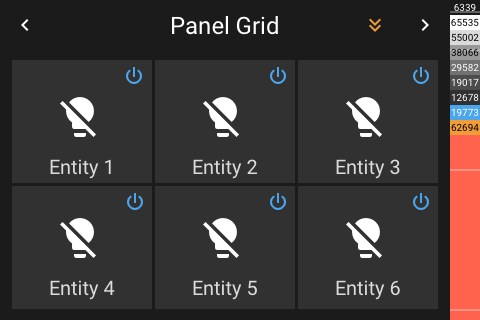
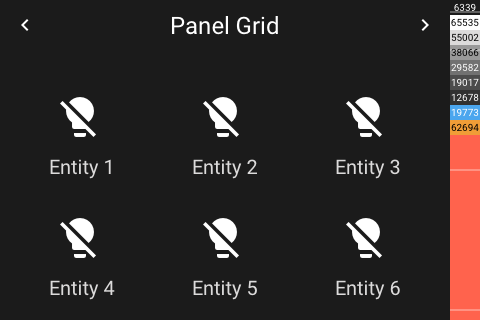
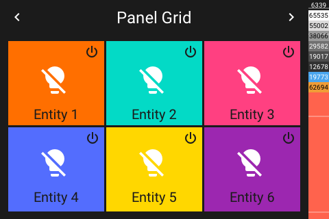
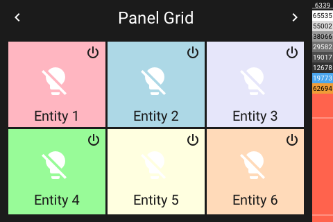

# Panel Grid

[< All Panels](README.md) | [Configuration](../Config.md) | [FAQ](../FAQ.md)

- [Panel Grid](#panel-grid)
  - [About](#about)
  - [Config](#config)
    - [Text Color `text_color`](#text-color-text_color)
    - [Power Color `power_color`](#power-color-power_color)
    - [Background Color `back_color`](#background-color-back_color)
    - [Color Mode `color_mode`](#color-mode-color_mode)
    - [Color Seed `color_seed`](#color-seed-color_seed)
    - [Show a Power Button `show_power_button`](#show-a-power-button-show_power_button)
    - [Initial Page `initial_page`](#initial-page-initial_page)
  - [Screens](#screens)

## About

`type: grid`

The entities grid panel provides a panel with 6 big buttons. If more than 6 entities are provided, the entities can be scrolled.

This panel can be also used to organize panels and subpanels. Colors can be set for the individual tiles. Also a random color mode is available.

## Config

```yaml
# Default config with default entity settings
panels:
  - type: grid
    text_color: null
    power_color: null
    back_color: null
    color_mode: null
    color_seed: null
    show_power_button: false
    initial_page: 0
    entities:
      - entity: light.example_light
        text_color: null
        power_color: null
        back_color: null
        color_mode: null
        color_seed: null
        show_power_button: null
```

Example config with color backgrounds:

```yaml
# grid panel with 7 entities and a vibrant color mode
panels:
  - type: grid
    color_mode: vibrant
    color_seed: 938
    entities:
      - entity: light.example_light
      - entity: light.example_light1
      - entity: light.example_light2
      - entity: light.example_light3
      - entity: light.example_light4
      - entity: light.example_light5
      - entity: light.example_light6
```

### Text Color `text_color`

Set the text color of the grid button using `text_color`.

```yaml
panels:

  - type: grid
    text_color: 6339
    # text_color: [49, 49, 49]
    entities:
      - entity: light.example_light
        text_color: 6339
```

### Power Color `power_color`

Set the power button color of the grid button using `power_color`.

```yaml
panels:

  - type: grid
    power_color: 6339
    # power_color: [49, 49, 49]
    entities:
      - entity: light.example_light
        power_color: 6339
```

### Background Color `back_color`

Set the background color of a grid button using `back_color`.

```yaml
panels:

  - type: grid
    back_color: 6339
    # back_color: [49, 49, 49]
    entities:
      - entity: light.example_light
        back_color: 6339
```

### Color Mode `color_mode`

Possible `color_mode` values:

- `null` No background (default)
- `vibrant` Random background color with vibrant colors
- `pastel` Random background color with pastel colors
- `light` Random background color with light colors
- `dark` Random background color with dark colors
- `lighten` Background color with a light color
- `darken` Background color with a dark color

```yaml
panels:

  - type: grid
    # Setting a color mode
    color_mode: vibrant
    color_seed: 18

  # Overwriting a color mode for a single entity
  - type: grid
    color_mode: vibrant
    color_seed: 18
    entities:
      - entity: light.example_light
      - entity: light.example_light1
        # disable color mode for this entity
        color_mode: null
      - entity: light.light_example2
```

### Color Seed `color_seed`

Value: int value between 0-1000.

The generated palettes can be reproduced using a seed value. The same seed will generate the same colors.

```yaml
panels:

  - type: grid
    color_mode: vibrant
    # Setting a color seed
    color_seed: 18
```

### Show a Power Button `show_power_button`

The entities can show a power button by setting `show_power_button` to true.

```yaml
panels:

  # for a single entity
  - type: grid
    entities:
      - entity: light.example_light
        show_power_button: true
      - entity: light.example_light1

  # for all entities
  - type: grid
    show_power_button: true
    entities:
      - entity: light.example_light
      - entity: light.example_light1
```

### Initial Page `initial_page`

The page to start the üanel with can be set with  `initial_page`.

```yaml
# grid panel with 7 entities and a inital page
panels:
  - type: grid
    color_mode: vibrant
    color_seed: 938
    initial_page: 1
    entities:
      - entity: light.example_light
      - entity: light.example_light1
      - entity: light.example_light2
      - entity: light.example_light3
      - entity: light.example_light4
      - entity: light.example_light5
      - entity: light.example_light6
```

## Screens




Simple grid (no background, no power button):



Color Mode vibrant:



Color Mode pastel:


