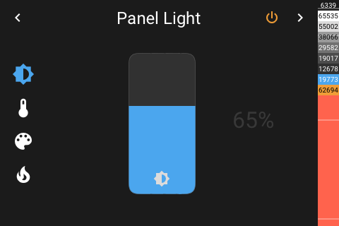
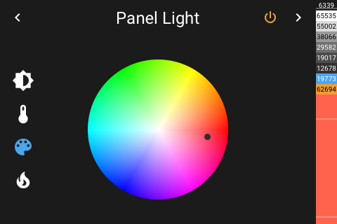

# Panel Light

[< All Panels](README.md) | [Configuration](../Config.md) | [FAQ](../FAQ.md)




Light entity is off:


Light entity is on / color temperature:


Light entity is on / color:



Light entity is on / effect is active:


## About

The light entity panel allows to control a single light entity.

```yaml
type: light
```

The functions available depend on the light entity being used. Only buttons for supported functions will appear.

## Config

```yaml
```
