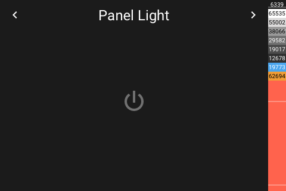

# Panel Light

[< All Panels](README.md) | [Configuration](../Config.md) | [FAQ](../FAQ.md)

- [Panel Light](#panel-light)
  - [Visualization](#visualization)
  - [About](#about)
  - [Popup](#popup)
  - [Config](#config)

## Visualization


Light entity is off:



Light entity is on / color temperature:


Light entity is on / color:


Light entity is on / effect is active:


Popup:


## About

`type: light`

The light entity panel allows to control a single light entity.

The functions available depend on the light entity being used. Only buttons for supported functions will appear.

## Popup

`type: popup_light`

`key: popup_light_key`

The light entity detail panel allows to control a single light entity.

The functions available depend on the light entity being used. Only buttons for supported functions will appear.

**If the entity is not available then the popup will close automatically.**

## Config

```yaml
panels:
  - type: light
    entity: light.example_light
```