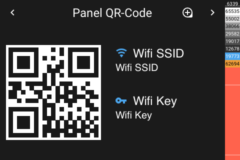
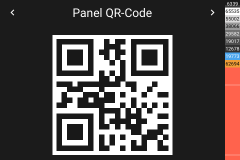

# Panel QR-Code

[< All Panels](README.md) | [Configuration](../Config.md) | [FAQ](../FAQ.md)

- [Panel QR-Code](#panel-qr-code)
  - [About](#about)
  - [Config](#config)
    - [QR-Code Format](#qr-code-format)
  - [Screens](#screens)

## About

`type: qr`

The QR-Code panel can be used to display a qr code containing provided informations for example wifi access.

The panel can show 2 different qr code sizes. It will display a big qr code if there are no entities configured. If there are entities then a smaller qr code will be shown on one half and entity informations on the other.

If the smaller qr code is available, by touching the qr code the big qr code will be displayed and vice versa.

If the big qr code is activated, then the display will not turn off.

The entity values will be split on two lines if value is longer than 15 characters.

## Config

```yaml
panels:

  # big qr code
  - type: qr
    qr_code: WIFI:S:MySSID;T:WPA;P:MyPassW0rd;;

  # small qr code
  - type: qr
    qr_code: WIFI:S:MySSID;T:WPA;P:MyPassW0rd;;
    entities:
      - entity: "text:Test 1"
        name: Title 1
        icon: mdi:key
      - entity: "text:Test 2"
        name: Title 2
        icon: mdi:wifi
```

### QR-Code Format

Source: [https://en.wikipedia.org/wiki/QR_code#Joining_a_Wi%E2%80%91Fi_network](https://en.wikipedia.org/wiki/QR_code#Joining_a_Wi%E2%80%91Fi_network)

The qr code can be created by using the format below.

```yaml
    Common format: WIFI:S:<SSID>;T:<WEP|WPA|blank>;P:<PASSWORD>;H:<true|false|blank>;;
    Sample: WIFI:S:MySSID;T:WPA;P:MyPassW0rd;;
```

## Screens




Panel with zoomed qr-code:


Big qr-code without text:


