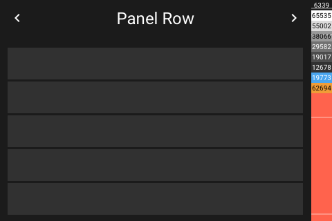

# Panel Row

[< All Panels](README.md) | [Configuration](../Config.md) | [FAQ](../FAQ.md)

## About

`type: row`

The entities row panel provides a panel with 5 rows. If more than 5 entities are provided, the entities can be scrolled.

This panel can be also used to organize panels and subpanels.

## Config

```yaml
# Default config with default entity settings
panels:
  - type: row
    entities:
      - entity: light.example_light
```

If more than 5 entities are configured, a next-page button appears. The panel
remembers which page you last viewed and returns to it on revisit — this is
automatic, not configurable.

## Screens



