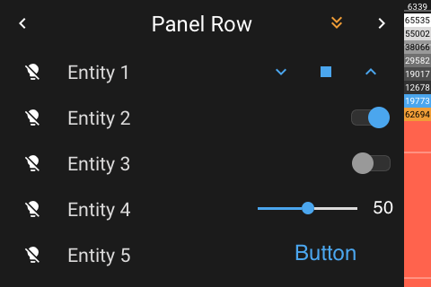

# Panel Row

[< All Panels](README.md) | [Configuration](../Config.md) | [FAQ](../FAQ.md)

## About

`type: row`

Shows entities in rows.

This panel can be also used to organize panels and subpanels.
type: grid

The entities row panel provides a panel with 5 rows. If more than 5 entities are provided, the entities can be scrolled.

This panel can be also used to organize panels and subpanels.

## Config

```yaml
# Default config with default entity settings
panels:
  - type: row
    initial_page: 0
    entities:
      - entity: light.example_light
```

## Screens



