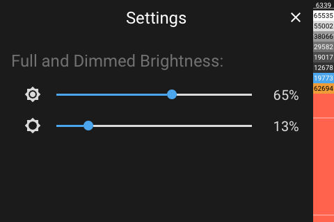

# Panel Settings

[< All Panels](README.md) | [Configuration](../Config.md) | [FAQ](../FAQ.md)



## About

This panel is being used to provide settings on the device.

```yaml
key: sys_settings
type: system_settings
```

Available settings:

- full brightness
- dimmed brightness

This panel a system panel and should not be used in the configuration.

## Config

```yaml
# No config
```
