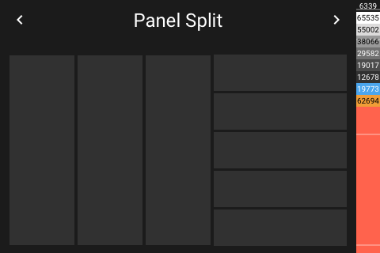

# Panel Split

[< All Panels](README.md) | [Configuration](../Config.md) | [FAQ](../FAQ.md)

- [Panel Split](#panel-split)
  - [About](#about)
  - [Config](#config)
  - [Screens](#screens)

## About

`type: split`

Shows a splitted screen with entities to control.

This panel can be also used to organize panels and subpanels.

## Config

```yaml
panels:

```

## Screens



