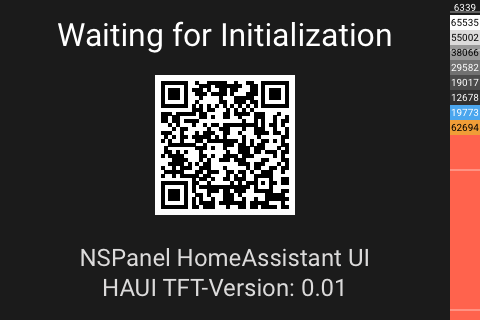
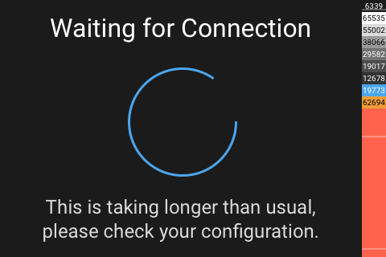

# Panel System

[< All Panels](README.md) | [Configuration](../Config.md) | [FAQ](../FAQ.md)

- [Panel System](#panel-system)
  - [About](#about)
  - [Config](#config)
  - [Screens](#screens)

## About

`type: system`

`key: sys_system`

The system panel is the entry point when connecting. On initial connection it will show a QR code with a url leading to docs. If once initialized and connected then it will show a localized message when disconnected.

**This panel a system panel and should not be used in the configuration.**

## Config

```yaml
# No config available
```

## Screens



If the panel has connected once to the AD server, the screen will look this way:



