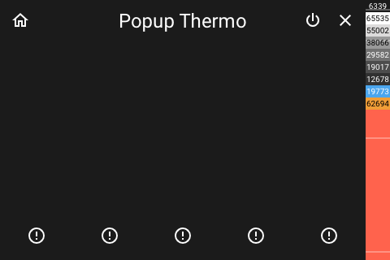

# Panel Thermo

[< All Panels](README.md) | [Configuration](../Config.md) | [FAQ](../FAQ.md)

- [Panel Thermo](#panel-thermo)
  - [About](#about)
  - [Popup](#popup)
  - [Config](#config)
  - [Screens](#screens)

## About

`type: thermo`

## Popup

`type: popup_thermo`

## Config

```yaml
```

## Screens



