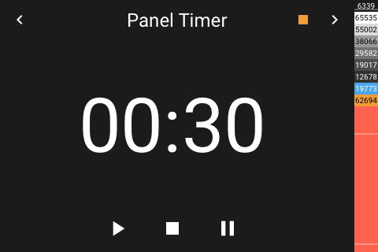
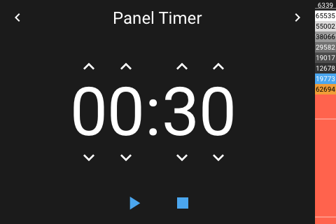
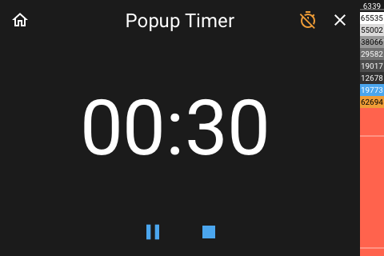

# Panel Timer

[< All Panels](README.md) | [Configuration](../Config.md) | [FAQ](../FAQ.md)

- [Panel Timer](#panel-timer)
  - [About](#about)
  - [Popup](#popup)
  - [Config](#config)
  - [Notification on timer end](#notification-on-timer-end)
  - [Screens](#screens)

## About

The timer panel allows to run a (for now local) timer. If a time bigger than 0 is set, the timer will run backwards, if a time of 0 is set, the timer will run forward.

`type: timer`

## Popup

`type: popup_timer`

`key: popup_timer`

## Config

```yaml
panels:
  - type: timer
    show_notification: false
```

## Notification on timer end

When the timer finishes, a sound will be played. Additionally, a notification can be shown by setting `show_notification` to true.

## Screens




Active timer:



Popup:


