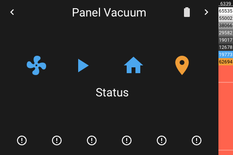

# Panel Vacuum

[< All Panels](README.md) | [Configuration](../Config.md) | [FAQ](../FAQ.md)

- [Panel Vacuum](#panel-vacuum)
  - [About](#about)
  - [Popup](#popup)
  - [Config](#config)
  - [Screens](#screens)

## About

`type: vacuum`

The vacuum entity panel allows to control a vacuum entity.

## Popup

`type: popup_vacuum`

`key: popup_vacuum_key`

## Config

```yaml
panels:
  - type: vacuum
    entity: vacuum.example_vacuum
```

## Screens



