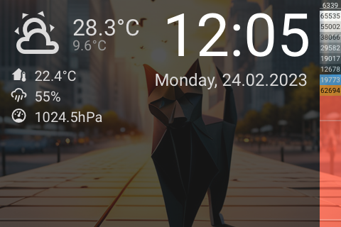

# Panel Weather

[< All Panels](README.md) | [Configuration](../Config.md) | [FAQ](../FAQ.md)

- [Panel Weather](#panel-weather)
  - [About](#about)
  - [Config](#config)
    - [Forecast](#forecast)
    - [Background](#background)
    - [Show Notifications](#show-notifications)
  - [Screens](#screens)

## About

`type: weather`

The weather panel can be used as a "screensaver". It will show weather details and other configured informations.

## Config

```yaml
panels:

  # weather panel
  - type: weather
    entity: weather.home

  # weather panel with forecast
  - type: weather
    entity: weather.home
    forecast: sensor.weather_forecast_hourly

  # weather panel with a background and forecast
  - type: weather
    entity: weather.home
    forecast: sensor.weather_forecast_hourly
    background: dog_1
    show_notifications: false
```

### Forecast

To get weather forecasts on the panel, the sensor containing the forecast data needs to be set. Use the `forecast` param.

`forecast: sensor.weather_forecast_hourly` or `forecast: sensor.weather_forecast_daily`.

See [FAQ](../FAQ.md) for details about the forecast sensor.

### Background

The weather can have different background images. To set a background use the `background` param.

Possible values:

- default
- spring
- summer
- autumn
- winter
- dog_1
- dog_2
- cat

Dynamic background values are possible using HomeAssistant templates.

`background: template:{...}`

The return value should match a background name.

### Show Notifications

The notifications icon can be hidden by setting `show_notifications` to `False`

## Screens





