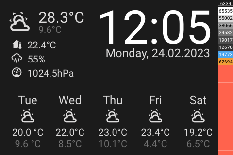
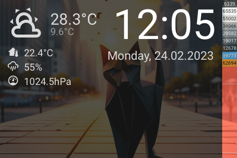
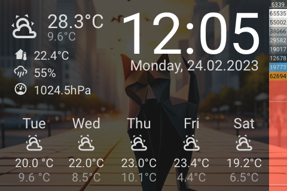

# Panel Weather

[< All Panels](README.md) | [Configuration](../Config.md) | [FAQ](../FAQ.md)

- [Panel Weather](#panel-weather)
  - [About](#about)
  - [Config](#config)
    - [Background](#background)
    - [Show forecast](#show-forecast)
    - [Show weather](#show-weather)
    - [Show temperature](#show-temperature)
    - [Show Notifications](#show-notifications)
  - [Screens](#screens)

## About

`type: weather`

The weather panel can be used as a "screensaver". It will show weather details and other configured informations.

## Config

```yaml
panels:

  # weather panel
  - type: weather
    entity: weather.home

  # weather panel with forecast
  - type: weather
    entity: weather.home
    forecast_type: hourly

  # weather panel with a background, forecast, and home temp
  - type: weather
    entity: weather.home
    forecast_type: daily
    background: dog_1
    show_home_temp: True
    show_notifications: false
```


### Info Items

Additional sensor entities can be shown as info panels below the main weather data using `info_items`. Max 2 items.

```yaml
panels:
  - type: weather
    entity: weather.home
    info_items:
      - entity: sensor.example_sensor_1
      - entity: sensor.example_sensor_2
```

### Entity Buttons

Quick-action buttons can be placed below the weather display using `entity_buttons`. Max 6 items.

```yaml
panels:
  - type: weather
    entity: weather.home
    entity_buttons:
      - entity: light.example_light
      - entity: switch.example_switch
```

### Background

The weather panel can have different background images. To set a background use the `background` param.

Possible values:

- dark
- modern
- spring
- summer
- autumn
- winter
- dog_1
- dog_2
- cat

Dynamic background values are possible using HomeAssistant templates.

`background: template:{...}`

The return value should match a background name.

### Show forecast

To get weather forecasts on the panel set `forecast_type` to `daily` or `hourly`.

### Show weather

The main weather icon can be hidden by setting `show_weather` to `False`.

### Show temperature

The main temperature text can be hidden by setting `show_temp` to `False`.
To add the home temperature `show_temp` and `show_home_temp` needs to be `True`.

### Show Notifications

The notifications icon can be hidden by setting `show_notifications` to `False`.

## Screens





