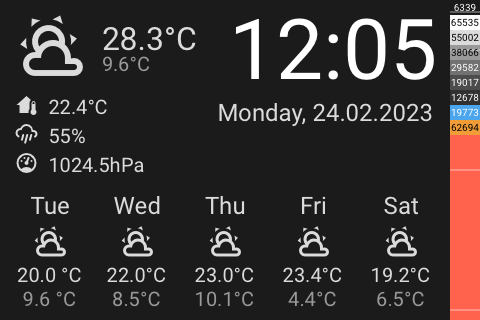

# Panel Weather

[< All Panels](README.md) | [Configuration](../Config.md) | [FAQ](../FAQ.md)

- [Panel Weather](#panel-weather)
  - [About](#about)
  - [Config](#config)
    - [Background](#background)
    - [Temperature Precision](#temperature-precision)
    - [Forecast Precision](#forecast-precision)
    - [Show forecast](#show-forecast)
    - [Show weather](#show-weather)
    - [Show temperature](#show-temperature)
    - [Show Notifications](#show-notifications)
  - [Screens](#screens)

## About

`type: weather`

The weather panel can be used as a "screensaver". It will show weather details and other configured informations.

## Config

```yaml
panels:

  # weather panel
  - type: weather
    entity: weather.home

  # weather panel with forecast
  - type: weather
    entity: weather.home
    show_forecast: hourl

  # weather panel with a background and forecast
  - type: weather
    entity: weather.home
    show_forecast: daily
    background: dog_1
    temp_precision: 1
    forecast_precision: 0
    show_temp: True
    show_home_temp: True
    show_notifications: false
```


### Background

The weather panel can have different background images. To set a background use the `background` param.

Possible values:

- default
- spring
- summer
- autumn
- winter
- dog_1
- dog_2
- cat

Dynamic background values are possible using HomeAssistant templates.

`background: template:{...}`

The return value should match a background name.

### Temperature Precision

The precision of the temperature can be set using `temp_precision`. Defaults to 1.

### Forecast Precision

The precision of the forecast can be set using `forecast_precision`. Defaults to 0.

### Show forecast

To get weather forecasts on the panel set `show_forecast` to `daily`, `twice_daily` or `hourly`.

### Show weather

The main weather icon can be hidden by setting `show_weather` to `False`

### Show temperature

The main temperature text can be hidden by setting `show_temp` to `False`
To add the home temperature `show_temp` and `show_home_temp` needs to be `True`

### Show Notifications

The notifications icon can be hidden by setting `show_notifications` to `False`

## Screens




