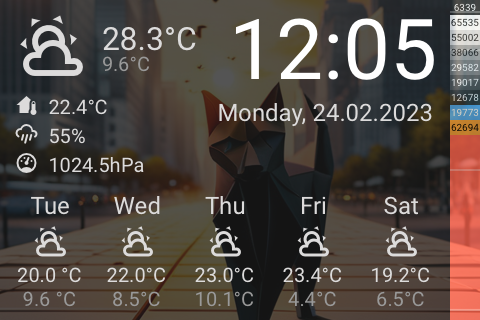

# Panel Weather

[< All Panels](README.md) | [Configuration](../Config.md) | [FAQ](../FAQ.md)




## About

```yaml
type: weather
```

The weather panel can be used as a "screensaver". It will show weather details and other configured informations.

## Config

```yaml
panels:
  # weather panel
  - type: weather
    entity: weather.home
```
