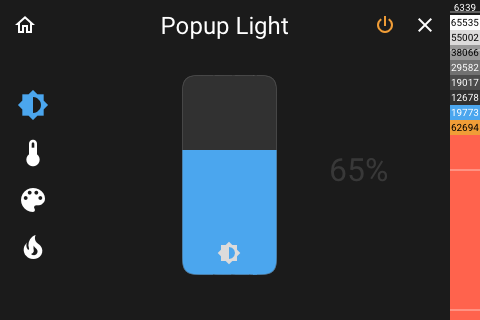

# Popup Light

[< All Panels](README.md) | [Configuration](../Config.md) | [FAQ](../FAQ.md)



for more panel images see [Light Panel](panel_light.md).

## About

The light entity detail panel allows to control a single light entity.

```yaml
key: popup_light_key
type: popup_light
```

The functions available depend on the light entity being used. Only buttons for supported functions will appear.

**If the entity is not available then the popup will close automatically.**

## Config

```yaml
```
