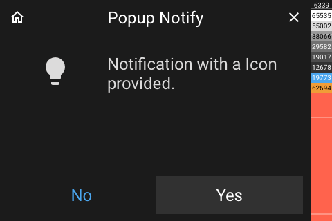
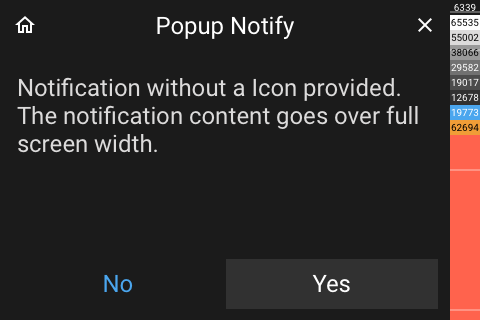

# Popup Notify

[< All Panels](README.md) | [Configuration](../Config.md) | [FAQ](../FAQ.md)

- [Popup Notify](#popup-notify)
  - [About](#about)
  - [Config](#config)
  - [Screens](#screens)

> For the notification queue shown when the notification bell is tapped, see [Popup Notifs](popup_notifs.md).

## About

`type: popup_notify`

`key: popup_notify`

The notification popup is used for one-shot, ad-hoc popups - for example to notify the user about errors or to prompt a yes/no decision. It is opened programmatically and supports optional buttons and an optional icon.

The panel can also execute a callback on close to notify other parts about the notification result. In the callback the button states are available (which button was pressed).

When a button is visible and pressed the panel closes. Set `close_on_button: false` to keep it open after a button press.

## Config

```yaml
notification: Notification text
btn_right: Button right text
btn_left: Button left text
icon: icon name or char   # optional - omit or leave empty to show full-width text
btn_left_color: color definition
btn_right_color: color definition
btn_left_back_color: color definition
btn_right_back_color: color definition
icon_color: color definition
button_callback_fnc: function for button notification
close_callback_fnc: function for close notification
close_on_button: true
```

**Icon:**

`icon` is optional. When provided the text is shown in a narrower column beside the icon. When omitted (or set to an empty string) the text fills the full width.

**Automatically closing a notification:**

To automatically close a notification after some time use the `close_timeout` param.

**Getting notified when the popup is closed:**

Provide `close_callback_fnc`. This will be called when the popup closes.
Note: the page that set the callback is already stopped by the time the callback executes.

```python
# as a method
close_callback_fnc=self.callback

def callback(self):
    # do something

# as a lambda
close_callback_fnc=lambda: # do something
```

**Getting the pushed button from notification:**

Provide `button_callback_fnc`. This will be called when a button is pressed.
Note: the page that set the callback is already stopped by the time the callback executes.

```python
# as a method
button_callback_fnc=self.callback

def callback(self, btn_left: bool, btn_right: bool):
    # do something

# as a lambda
button_callback_fnc=lambda btn_left, btn_right: # do something
```

## Screens



Full width (no icon):


