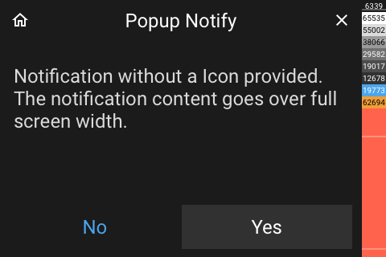

# Popup Notify

[< All Panels](README.md) | [Configuration](../Config.md) | [FAQ](../FAQ.md)

- [Popup Notify](#popup-notify)
  - [About](#about)
  - [Config](#config)
  - [Screens](#screens)

## About

`type: popup_notify`

`key: popup_notify`

The notification popup can be used in different ways. It is used internally to notify about errors or issues.

The notification popup can also execute a callback on close to notify other parts about the notification result. In the callback the button states are available (which button was pressed).

When a button is visible and pressed then the panel will get closed.

## Config

```yaml
notification: Notification text
btn_right: Button right text
btn_left: Button left text
icon: icon name or char
btn_left_color: color definition
btn_right_color: color definition
btn_left_back_color: color definition
btn_right_back_color: color definition
icon_color: color definition
button_callback_fnc: function for button notification
close_callback_fnc: function for close notification
```

**Automatically closing a notification:**

To automatically close a notification after some time use the `close_timeout` param.

**Getting notified when the selection popup is closed:**

provide param in code `close_callback_fnc`. This will get called when the popup is closed.
ATT: the page setting the callback is already stopped at the time the callback is executed.

```python
# as a method
close_callback_fnc=self.callback

def callback(self):
    # do something

# as a lambda

close_callback_fnc=lambda: # do something
```

**Getting the pushed button from notification:**

provide param in code `button_callback_fnc`. This will get called when a button is pressed.
ATT: the page setting the callback is already stopped at the time the callback is executed.

```python
# as a method
button_callback_fnc=self.callback

def callback(self, btn_left: bool, btn_right: bool):
    # do something

# as a lambda

button_callback_fnc=lambda btn_left, btn_right: # do something
```

## Screens


Full width:


