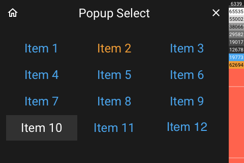

# Popup Select

[< All Panels](README.md) | [Configuration](../Config.md) | [FAQ](../FAQ.md)

- [Popup Select](#popup-select)
  - [Visualization](#visualization)
  - [About](#about)
  - [Config](#config)
    - [Selection](#selection)

## Visualization



More than 12 Items:


## About

`type: popup_select`

`key: popup_select`

The select popup allows to select a value from a list. It is possible to define a
selected value.

## Config

```yaml
selected: Id of selected item
selection: List of items to display
close_on_select: should the popup be closed after selection, Default True
selection_callback_fnc: function for selection
close_callback_fnc: function for close
```

### Selection

The `selection` needs to be a list.
Provide `selected` to select a value.

The values can either be str, list, tuple or dict.

The id will be used as a identifier [index 0].
The name will be used for display [index 1].

Examples:

```python
str:
selected = 'item 1'
selection = ['item 1', 'item 2', 'item 3']
list:
selected = 0
selection = [[0, 'item 1'], [1, 'item 2'], [2, 'item 3']]
tuple:
selected = 0
selection = [(0, 'item 1'), (1, 'item 2'), (2, 'item 3')]
dict:
selected = 0
selection = [{'id': 0, 'name': 'item 1'}, {'id': 1, 'name': 'item 2'}, {'id': 0, 'name': 'item 3'}]
```

**Automatically closing a selection popup:**

To automatically close a selection poup after some time use the `close_timeout` param.

**Getting notified when the selection popup is closed:**

provide param in code `close_callback_fnc`. This will get called the popup is closed.

```python
# as a method
close_callback_fnc=self.callback

def callback(self):
    # do something

# as a lambda

close_callback_fnc=lambda: # do something
```

**Getting the selection:**

provide param in code `selection_callback_fnc`. This will get called when a selection is made.

The callback will get the name of the selection as a param.

```python
# as a method
selection_callback_fnc=self.callback

def callback(self, selected):
    # do something

# as a lambda

selection_callback_fnc=lambda selected: # do something
```
