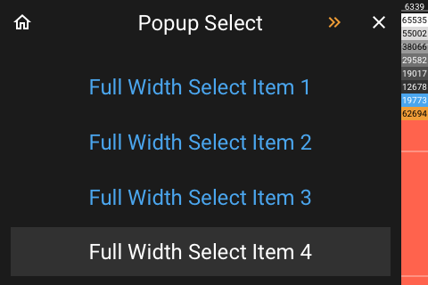

# Popup Select

[< All Panels](README.md) | [Configuration](../Config.md) | [FAQ](../FAQ.md)

- [Popup Select](#popup-select)
  - [About](#about)
  - [Config](#config)
    - [Select mode](#select-mode)
    - [Select multiple Items](#select-multiple-items)
    - [Selection](#selection)
  - [Automatically closing a selection popup](#automatically-closing-a-selection-popup)
  - [Getting notified when the selection popup is closed](#getting-notified-when-the-selection-popup-is-closed)
  - [Getting the selection](#getting-the-selection)
  - [Screens](#screens)

## About

`type: popup_select`

`key: popup_select`

The select popup allows to select a value from a list. It is possible to define a
selected value.

If selection is bigger than available items, a function button in the header to open the next page will be displayed.

## Config

```yaml
select_mode: What kind of display of selection, Default None (default, full)
selected: Id of selected item
items: List of items to display
multiple: Allow to select multiple items, Default False
multiple_delay: Delay before closing when multiple is True, Default 1.5
close_on_select: Should the popup be closed after selection, Default True
selection_callback_fnc: Function for selection
close_callback_fnc: Function for close
```

### Select mode

The `select_mode` can be used to display full width items.

Possible value for select_mode:

- `default` or `None` default mode: 3x4 Buttons
- `full` full width mode: 4 buttons

### Select multiple Items

Set `multiple` to True to allow to select items. `multiple_delay` allows to control the delay before closing. The callback will recieve a list instead of a string value.

### Selection

The `items` needs to be a list.
Provide `selected` to select a value.

The values can either be str, list, tuple or dict.

The value will be used as a identifier [index 0].
The name will be used for display [index 1].

Examples:

```python
str:
selected = 'item 1'
items = ['item 1', 'item 2', 'item 3']
list:
selected = 0
items = [[0, 'item 1'], [1, 'item 2'], [2, 'item 3']]
tuple:
selected = 0
items = [(0, 'item 1'), (1, 'item 2'), (2, 'item 3')]
dict:
selected = 0
items = [{'value': 0, 'name': 'item 1'}, {'value': 1, 'name': 'item 2'}, {'value': 0, 'name': 'item 3'}]
```

## Automatically closing a selection popup

The popup will close after a selection was made or after `multiple_delay` of seconds if `multiple` is set to True. This only happens if `close_on_select` is True.

To automatically close a selection poup after some time use the `close_timeout` param.

## Getting notified when the selection popup is closed

provide param in code `close_callback_fnc`. This will get called the popup is closed.

```python
# as a method
close_callback_fnc=self.callback

def callback(self):
    # do something

# as a lambda

close_callback_fnc=lambda: # do something
```

## Getting the selection

provide param in code `selection_callback_fnc`. This will get called when a selection is made.

The callback will get the value of the selection as a param.

```python
# as a method
selection_callback_fnc=self.callback

def callback(self, selected):
    # do something

# as a lambda

selection_callback_fnc=lambda selected: # do something
```

## Screens


Full width selection items:


