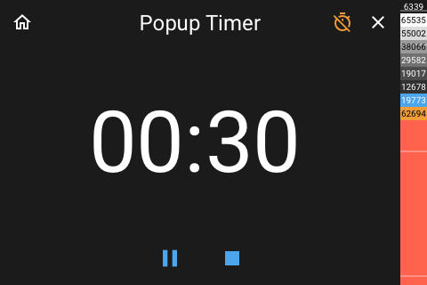

# Popup Timer

[< All Panels](README.md) | [Configuration](../Config.md) | [FAQ](../FAQ.md)



for more panel images see [Timer Panel](panel_timer.md).

## About

```yaml
key: popup_timer
type: popup_timer
```

## Config

```yaml
```
