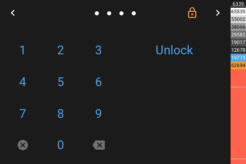

# Popup Unlock

[< All Panels](README.md) | [Configuration](../Config.md) | [FAQ](../FAQ.md)

- [Popup Unlock](#popup-unlock)
  - [About](#about)
  - [Config](#config)
  - [Screens](#screens)

## About

`type: popup_unlock`

`key: popup_unlock`

The unlock popup panel is being used internally to provide a unlocking mechanism for panels.

To use this panel, just set a unlock code to any other panel.

This panel is using the buttons of the locked panel.

## Config

The unlock code needs to be a string.

```yaml
panels:

  # this panel will be locked and can be unlocked using the unlock code
  - type: grid
    title: Unlock Panel
    # set a unlock code
    unlock_code: "1234"
```

## Screens


While inputting keycode:



Unlocked state:


