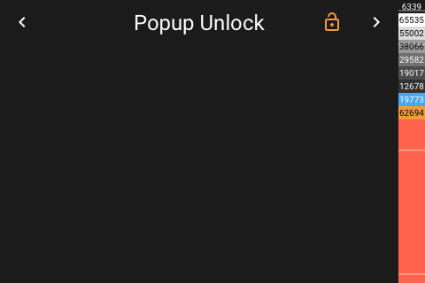

# Popup Unlock

[< All Panels](README.md) | [Configuration](../Config.md) | [FAQ](../FAQ.md)


While inputting keycode:


Unlocked state:



## About

The unlock popup panel is being used internally to provide a unlocking mechanism for panels.

```yaml
key: popup_unlock
type: popup_unlock
```

To use this panel, just set a unlock code to any other panel.

This panel is using the buttons of the locked panel.

## Config

The unlock code needs to be a string.

```yaml
panels:
  # this panel will be locked and can be unlocked using the unlock code
  - type: grid
    title: Unlock Panel
    unlock_code: "1234"
```
